# Relatório Técnico — Tech Challenge Fase 4
## Sistema de Monitoramento Hospitalar Multimodal (Vídeo, Áudio e Sinais Vitais)

**Curso:** FIAP AI para DEVs (8IADT)  
**Grupo:** 30  
**Integrantes:**
- Rodrigo de Araújo Rosa
- Elias Maximiano da Silva
- Fábia Gomes de Jesus
- Danilo Pereira

**Data:** Julho de 2026

---

> As três entregas técnicas estão implementadas e validadas contra o *ground-truth* de
> cada dataset. Os números apresentados foram medidos nas execuções descritas, e as
> limitações encontradas estão declaradas nas respectivas seções.

---

## 1. Introdução

Este relatório documenta o desenvolvimento do Tech Challenge — Fase 4, cujo objetivo é
construir um **Sistema de Monitoramento Hospitalar Multimodal** capaz de acompanhar
continuamente pacientes em ambiente hospitalar/UTI a partir de dados de **vídeo, áudio e
séries temporais de sinais vitais**, identificando sinais precoces de risco e emitindo
alertas automáticos para a equipe médica.

A solução integra três entregas técnicas independentes, unidas pelo cenário clínico:
análise de vídeo de sessões de reabilitação (estimação de pose e detecção de desvios
posturais), análise de áudio de consultas (transcrição e extração de achados clínicos) e detecção
de anomalias em sinais vitais, prescrições e padrões de movimentação.

> **AVISO — Uso exclusivamente acadêmico.** Este sistema não deve ser utilizado para
> diagnóstico, prescrição ou qualquer conduta clínica em pacientes reais. Os datasets são
> públicos e, por prática acadêmica padrão, não correspondem aos mesmos pacientes nas três
> modalidades.

### 1.1 Objetivo

Desenvolver um sistema que:

1. Processe vídeos clínicos e detecte movimentos/eventos fora do padrão esperado (análise
   postural com OpenPose), gerando relatórios automáticos de desvios
2. Processe áudios de consultas, transcreva a fala (Amazon Transcribe) e identifique
   termos críticos e achados clínicos (Amazon Comprehend Medical)
3. Aplique técnicas de detecção de anomalias em séries temporais de sinais vitais,
   evolução de prescrições e padrões de movimentação
4. Integre serviços gerenciados em nuvem (AWS — ver 4.2 sobre a troca de provedor) e
   produza um fluxo de alerta à equipe médica

### 1.2 Entregáveis do Projeto

| Entregável | Link |
|:---|:---|
| Este Relatório | `reports/TECHNICAL_REPORT_FASE4.md` |
| Repositório | https://github.com/rodrigoaraujorosa/fiap-ia-devs-8iadt-fase4-tech-challenge |
| Vídeo (até 15 min) | (a publicar — YouTube/Vimeo) |
| App de demonstração (Gradio) | `python -m src.video.app` |

### 1.3 Visão Geral das Três Entregas

| # | Entrega | Objetivo | Dataset | Modelos / Serviços | Estado |
|:--|:--|:--|:--|:--|:--|
| 1 | Análise de Vídeo | Detectar desvios posturais em vídeos de reabilitação | REHAB24-6 (RGB + rótulos correto/incorreto) | OpenPose (BODY_25), IsolationForest, z-score robusto | **Implementada e validada** (3 vídeos, contra os rótulos de execução) |
| 2 | Análise de Áudio | Transcrever a fala, extrair achados clínicos e analisar o sentimento | Consultas médicas simuladas (transcrição humana como referência) | Amazon Transcribe, Comprehend Medical, Comprehend, Translate | **Implementada e validada** (4 consultas, contra a transcrição humana) |
| 3 | Detecção de Anomalias | Anomalias em sinais vitais, prescrições e movimentação | PhysioNet Challenge 2019, UCI HAR, Synthea | IsolationForest (baseline) | Baseline implementado, **ainda não executado com dados reais** |

> **Critério de "validada".** Uma entrega é considerada validada quando seus resultados
> são **medidos contra um ground-truth independente**, e não apenas exibidos. Na Entrega 1,
> os desvios posturais são cruzados com os rótulos de execução correta/incorreta do
> REHAB24-6 (3.8); na Entrega 2, a transcrição automática é medida contra a transcrição
> humana revisada do dataset (WER, 4.4) e a extração clínica é comparada entre as duas
> origens (recall, 4.5). A Entrega 3 dispõe de ground-truth (`SepsisLabel` e os rótulos de
> atividade), mas ainda não foi executada com os dados reais.

### 1.4 Datasets Utilizados

| Modalidade | Dataset | Acesso | Observação |
|:--|:--|:--|:--|
| Vídeo | REHAB24-6 | Aberto (Zenodo, ~2,7 GB) | RGB + rótulos de execução correta/incorreta |
| Áudio | Consultas médicas simuladas | Aberto (figshare, CC0) | 272 consultas com áudio e transcrição humana |
| Sinais vitais | PhysioNet/CinC Challenge 2019 | Aberto (~42 MB) | 40.336 pacientes de UTI, séries horárias |
| Movimentação | UCI HAR | Aberto (~60 MB) | 561 features (acelerômetro + giroscópio), 6 atividades |
| Prescrições | Synthea (sintético) | Aberto | Gerador de registros clínicos sintéticos |

---

## 2. Arquitetura Geral do Sistema

O sistema é composto por três pipelines independentes (um por modalidade) que convergem
para uma camada de fusão e alerta. Cada modalidade produz um sinal de anomalia
interpretável que pode disparar um alerta à equipe médica.

```
[Vídeo: reabilitação]  ── OpenPose ──► keypoints ──► ângulos ──► desvios ─┐
                                                                          │
[Áudio: consulta]  ── Transcribe ──► transcrição ──► Comprehend Medical ─┤
                                                                          ├─► fusão / alerta
                                                                          │    à equipe médica
[Sinais vitais / movimentação / prescrições]  ── IsolationForest ────────┘
```

### 2.1 Componentes por Modalidade

| Modalidade | Entrada | Processamento | Saída |
|:--|:--|:--|:--|
| Vídeo | vídeo RGB (.mp4) | OpenPose (BODY_25) → ângulos articulares → detecção de desvios | relatório + vídeo anotado |
| Áudio | consulta (.mp3) | Amazon Transcribe + Comprehend Medical | transcrição + achados clínicos tipados |
| Anomalias | séries temporais (.psv/.txt/.csv) | IsolationForest + z-score | frames/horas anômalas + alertas |

### 2.2 Princípio de Projeto: Desacoplamento

Cada modalidade é autocontida e independe das demais para executar. A integração ocorre na
camada de alerta, que consome os sinais de anomalia de cada pipeline. Esse desacoplamento
permite desenvolver, testar e avaliar cada entrega separadamente — coerente com a natureza
dos datasets (fontes distintas, sem pacientes compartilhados).

---

### 2.3 Modelos Aplicados por Tipo de Dado

| Tipo de dado | Tarefa | Modelo / serviço | Natureza |
|:--|:--|:--|:--|
| **Vídeo** (RGB) | estimação de pose 2D | **OpenPose, arquitetura BODY_25** (v1.7.0) | modelo aberto, arquitetura e pesos públicos |
| Vídeo (ângulos) | detecção de desvio | **z-score robusto (mediana + MAD)** ∪ **IsolationForest** | algoritmos clássicos, implementados localmente |
| **Áudio** (fala) | reconhecimento de fala + diarização | **Amazon Transcribe** (`en-US`, `MaxSpeakerLabels=2`) | serviço gerenciado |
| Áudio (texto) | extração de entidades clínicas | **Amazon Comprehend Medical** (`DetectEntitiesV2`) | serviço gerenciado |
| Áudio (texto) | classificação de sentimento | **Amazon Comprehend** (`DetectSentiment`, `BatchDetectSentiment`) | serviço gerenciado |
| Áudio (texto) | tradução en→pt | **Amazon Translate** (`TranslateText`) | serviço gerenciado |
| **Séries temporais** | detecção de anomalia | **IsolationForest** (`contamination` ajustado por subtarefa) | algoritmo clássico, implementado localmente |

**Uma diferença que vale explicitar.** No vídeo, o modelo é **nomeado e auditável**: a
arquitetura BODY_25 é pública, os pesos são distribuídos, e é possível inspecionar os 25
keypoints que ela produz. No áudio, os modelos são **proprietários e não publicados** — a
AWS expõe a tarefa e o contrato da API, não a arquitetura nem os dados de treino.

Isso é uma consequência direta do requisito do enunciado de usar serviços gerenciados em
nuvem, e tem implicações que o trabalho procurou endereçar:

- **Não se pode inspecionar o modelo, mas pode-se medir sua saída.** Daí a decisão de
  validar o Transcribe contra a transcrição humana do dataset (WER, 4.4) e o Comprehend
  Medical comparando as extrações sobre as duas transcrições (recall, 4.5), em vez de
  apenas exibir os resultados.
- **A versão da API importa e fica registrada.** `DetectEntitiesV2` substitui a `V1` e
  devolve traços (`NEGATION`, `PERTAINS_TO_FAMILY`) que a versão anterior não tem — e é
  desses traços que depende a separação entre o que o paciente afirmou e o que negou.
- **O comportamento pode mudar sem aviso.** Modelos gerenciados são atualizados pelo
  provedor; os números aqui valem para as execuções de julho de 2026, cujos JSON brutos
  estão versionados em `reports/` para permitir auditoria posterior.

**Componentes determinísticos implementados neste trabalho** (não são modelos aprendidos,
mas participam da decisão e por isso constam aqui):

| Componente | Onde | Papel |
|:--|:--|:--|
| Seleção robusta de pessoa | `video/keypoints.py` | escolhe o paciente entre várias pessoas na cena |
| Cálculo de 9 ângulos articulares | `video/posture.py` | converte keypoints em variáveis clínicas |
| WER por distância de edição | `audio/transcribe.py` | mede o erro da transcrição contra a referência |
| Identificação do falante-paciente | `audio/transcribe.py` | dois sinais independentes, recusa-se a decidir se discordarem |
| Filtro de achados clínicos | `audio/comprehend.py` | descarta negados, hipotéticos, de familiares e abaixo de 0,70 |

---

## 3. Entrega 1 — Análise de Vídeo (OpenPose)

### 3.1 Visão Geral

O pipeline de vídeo processa gravações de sessões de reabilitação física, estima a pose 2D
do paciente com **OpenPose** e detecta **desvios posturais fora do padrão**, gerando um
relatório automático e um vídeo anotado.

A decisão de arquitetura central: o **OpenPose (binário externo) apenas extrai os keypoints
em JSON; todo o restante do pipeline é Python puro processando esses JSON**. Isso torna o
código independente do ambiente (portátil, roda em qualquer máquina) — e isola
a dependência mais pesada (compilação C++/CUDA) em um artefato pré-compilado.

```
vídeo .mp4 ──[OpenPose]──► JSON por frame ──► [pipeline Python] ──► relatório + gráfico + vídeo anotado
```

### 3.2 Dataset: REHAB24-6

O dataset escolhido é o **REHAB24-6**, um conjunto multimodal de exercícios de reabilitação
física publicado abertamente no Zenodo.

| Item | Descrição |
|:--|:--|
| Fonte | [zenodo.org/records/13305826](https://zenodo.org/records/13305826) |
| Acesso | Aberto, download direto (sem credenciamento) |
| Conteúdo | Vídeos RGB (2 câmeras, 30 fps), esqueletos 2D/3D, marcadores, segmentação |
| Tamanho | `videos.zip` ~2,7 GB |
| Exercícios | 6: abdução de braço, arm VW, flexões, abdução de perna, lunge, agachamento |
| Rótulos | Correção binária (correto/incorreto) por repetição + segmentação temporal |
| Repetições | 1.072 (568 corretas, 504 incorretas) |
| Licença | CC BY-NC 4.0 (uso acadêmico) |

**Justificativa da escolha.** O dataset originalmente previsto (KIMORE) tornou-se
indisponível (servidor da instituição fora do ar) e, além disso, os *mirrors* disponíveis
continham apenas dados de esqueleto (sem RGB), o que inviabilizaria o uso do OpenPose. O
REHAB24-6 supera o KIMORE para o objetivo desta entrega: fornece **vídeo RGB** e, crucialmente,
**rótulos explícitos de execução correta/incorreta**, que servem como *ground-truth* para
validar quantitativamente os desvios detectados.

**Rótulos (`Segmentation.csv`).** Cada repetição é descrita por `video_id`,
`repetition_number`, `exercise_id`, intervalo de frames (`first_frame`, `last_frame`),
orientação da câmera e `correctness` (0/1), entre outros campos.

### 3.3 Vídeos Utilizados: Três Experimentos

Foram executados **três experimentos** sobre vídeos do REHAB24-6, todos contendo execuções
corretas e incorretas no mesmo vídeo. Não são três repetições do mesmo teste: cada um isola
uma variável diferente.

| Atributo | PM_008 | PM_034 | PM_006 |
|:--|:--|:--|:--|
| Papel | validação quantitativa | demonstração | condição de captura adversa |
| Exercício | Ex6 — agachamento | Ex4 — abdução de perna | Ex4 — abdução de perna |
| Subtipo | — | perna esquerda | perna direita |
| Sujeito (`person_id`) | 1 | 4 | 1 |
| Resolução / taxa | 1920x1080, 30 fps | 1920x1080, 30 fps | 1920x1080, 30 fps |
| Duração | ~2 min 53 s (5.191 frames) | ~37 s (1.108 frames) | ~35 s (1.042 frames) |
| Orientação da câmera | frontal e meio-perfil | frontal | meio-perfil |
| Iluminação (`lights_on`) | 0 | 1 | 0 |
| Repetições | 27 | 10 | 10 |
| Correção | 21 corretas, 6 incorretas | 5 corretas, 5 incorretas | 5 corretas, 5 incorretas |
| `extra_person_in_cam17` | 0 | 0 | 3 |
| Pessoas extras observadas | 0 | 0 | **1** |

Os papéis:

- **PM_008** é o caso mais extenso (27 repetições) e o de maior volume de frames — a
  validação quantitativa principal, e o único de exercício diferente.
- **PM_034** é a execução em **condições favoráveis**: câmera frontal, luzes acesas, cena
  sem outras pessoas. É o vídeo da demonstração.
- **PM_006** é a execução em **condições adversas**: câmera em meio-perfil, luzes apagadas
  e uma pessoa ao fundo. Comparado ao PM_034, mede quanto o pipeline degrada fora do
  cenário ideal (resultados em 3.8).

> **Este par não é um experimento controlado.** PM_034 e PM_006 compartilham o exercício e a
> estrutura de repetições (10, sendo 5 corretas e 5 incorretas), mas diferem em **pelo menos
> cinco variáveis simultâneas**: sujeito (`person_id` 4 e 1), perna trabalhada (esquerda e
> direita), orientação da câmera (frontal e meio-perfil), iluminação (acesa e apagada) e
> presença de uma pessoa ao fundo. A diferença de desempenho entre eles é real e medida, mas
> **não pode ser atribuída a nenhuma dessas variáveis isoladamente** — em particular, a
> iluminação apagada é uma explicação tão plausível quanto o observador para a perda de
> qualidade na detecção de juntas. Isolar cada fator exigiria selecionar pares de vídeos que
> variem uma variável por vez, o que o REHAB24-6 permite e fica registrado como trabalho
> futuro.

> **Nota sobre o rótulo `extra_person_in_cam17`.** O campo assume os valores 0, 1, 2 e 3 no
> `Segmentation.csv`, mas a documentação do REHAB24-6 não acompanha o arquivo e **não foi
> possível confirmar se o valor é uma contagem de pessoas ou um código de categoria**. A
> inspeção direta do PM_006 (valor 3) mostra **uma única pessoa extra** em cena, o que
> descarta a leitura "valor = número de pessoas". A contagem usada neste relatório é
> portanto **empírica, medida sobre os próprios keypoints**: o OpenPose detecta 2 pessoas em
> 302 dos 348 frames do PM_006 (87%) e 1 pessoa em 361 dos 370 frames do PM_034 (97,6%).
> Para o argumento desta seção basta a diferença entre as cenas, que é inequívoca; o
> significado exato do rótulo fica em aberto.

### 3.4 Extração de Pose (OpenPose BODY_25)

A pose é estimada com o modelo **BODY_25** do OpenPose v1.7.0. O binário é invocado sobre o
vídeo com escrita dos keypoints em JSON (um arquivo por frame).

| Parâmetro | Valor | Observação |
|:--|:--|:--|
| Modelo | BODY_25 | 25 juntas 2D com confiança |
| `--net_resolution` | `320x176` (padrão local) | menor = menos VRAM |
| `--render_pose` | 0 | renderização feita pelo nosso overlay |
| Saída | 1 JSON por frame | `pose_keypoints_2d = [x0,y0,c0, ...]` |

**Desempenho e subamostragem.** Na GPU local (NVIDIA MX330, 2 GB), o OpenPose processa a
~1,2 s/frame (medido: `1.22s/frame` na execução da Figura 2). Processar os 5.191 frames de
PM_008 levaria ~1h45. Para viabilizar a execução local, o vídeo é **subamostrado para 1 a
cada 3 frames** (opção `--frame-step 3` do CLI; 10 fps efetivos, 1.731 frames), reduzindo o
tempo do OpenPose para os 45:20 medidos (o pipeline reporta o tempo no output e no
relatório) sem perda relevante para o movimento lento do agachamento. O mapeamento é
preservado: o índice `i` do keypoint corresponde ao frame original `3*i`, permitindo o
cruzamento correto com os rótulos (ver 3.8).

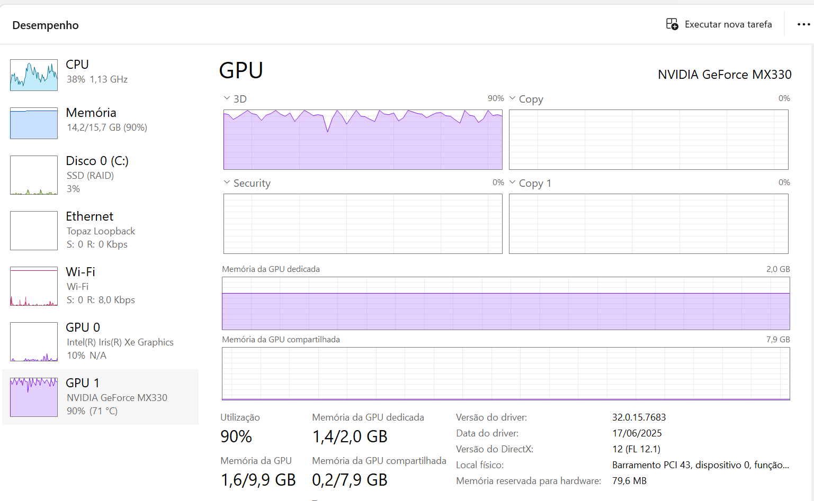

> **Figura 1.** Gerenciador de Tarefas durante a extração do PM_008. A MX330 opera em
> **90% de utilização a 71 °C**, com **1,4 dos 2,0 GB** de memória dedicada ocupados — é
> essa margem estreita de VRAM que justifica o `--net_resolution 320x176` da tabela acima:
> resoluções maiores não cabem. A carga está na GPU dedicada, não na integrada (Intel Iris
> Xe, 10%), confirmando que o OpenPose usa o dispositivo correto. O gargalo é a GPU, não a
> CPU (38%) — o que explica por que a subamostragem, e não o paralelismo, é a alavanca de
> desempenho disponível aqui.

### 3.5 Parser de Keypoints (`keypoints.py`)

O parser carrega os JSON do OpenPose em um `DataFrame` (uma linha por frame, colunas
`<Junta>_x`, `<Junta>_y`, `<Junta>_c`), com dois tratamentos importantes:

- **Seleção robusta da pessoa principal:** com múltiplas pessoas na cena (observadores ao
  fundo), escolhe-se a **maior e mais confiante** (área do bounding box × confiança média) —
  o paciente em primeiro plano domina e gente menor ao fundo é ignorada — com **estabilização
  temporal**, favorecendo o candidato mais próximo da seleção do frame anterior para não
  alternar entre pessoas. (A abordagem inicial, "maior confiança total por frame", podia
  travar na pessoa errada e corromper os ângulos.)
- **Descarte de juntas de baixa confiança:** juntas com confiança abaixo de `0.1` (ou não
  detectadas) têm coordenadas marcadas como `NaN`, evitando que ângulos sejam calculados
  sobre pontos espúrios em (0, 0).

O PM_006 (3.8) exercita essa estratégia no cenário mais difícil disponível — uma pessoa ao
fundo, luzes apagadas e câmera em meio-perfil: a seleção robusta preserva a separação entre
execuções corretas e incorretas, ainda que a margem caia de 10,5x para 2,8x em relação ao
vídeo capturado em condições favoráveis. Como os dois vídeos diferem em várias variáveis ao
mesmo tempo, essa queda não é atribuível isoladamente à presença da outra pessoa.

### 3.6 Ângulos Posturais (`posture.py`)

As coordenadas 2D são convertidas em uma série temporal de ângulos clinicamente relevantes.
São calculados 8 ângulos articulares de 3 pontos e a inclinação do tronco:

| Ângulo | Juntas (vértice em negrito) |
|:--|:--|
| Cotovelo (D/E) | Ombro — **Cotovelo** — Punho |
| Ombro (D/E) | Cotovelo — **Ombro** — Quadril |
| Quadril (D/E) | Ombro — **Quadril** — Joelho |
| Joelho (D/E) | Quadril — **Joelho** — Tornozelo |
| Inclinação do tronco | vetor Pescoço→MidQuadril em relação à vertical da imagem |

O ângulo em um vértice B é obtido pelo produto escalar dos vetores B→A e B→C:
`ângulo = arccos( (v1·v2) / (|v1||v2|) )`, com propagação de `NaN` quando alguma junta está
ausente.

### 3.7 Detecção de Desvios (`anomaly.py`)

Um frame é sinalizado como desvio pela **união** de duas técnicas complementares:

1. **Z-score robusto por ângulo** (mediana + MAD): sinaliza o frame quando *algum* ângulo se
   afasta muito do seu comportamento típico no vídeo (limiar `|z| > 3.5`). É interpretável —
   identifica-se qual articulação desviou (`worst_angle`).
2. **IsolationForest multivariado** (`contamination = 0.03`): aprende o padrão conjunto dos
   ângulos e marca frames globalmente atípicos (mesma técnica da Entrega 3).

A saída acrescenta, por frame: `z_anomaly`, `iso_anomaly`, `is_anomaly` (união), `worst_angle`
e `anomaly_score` (|z| máximo, severidade).

### 3.8 Validação contra o Ground-Truth (`validate.py`)

A validação cruza os frames sinalizados como desvio com os rótulos `correctness` do
REHAB24-6. Para cada repetição, calcula-se a taxa de frames anômalos; a expectativa é que
**repetições incorretas concentrem mais desvios que as corretas**. O parâmetro `frame_step`
ajusta o mapeamento quando o vídeo foi subamostrado (índice `i` ↔ frame original `N*i`). A
validação é acionada diretamente pelo pipeline com a opção `--segmentation` do CLI, que
imprime a taxa por classe e salva o detalhe por repetição em `reports/validacao_<vídeo>.csv`.

**Resultados quantitativos (PM_008).** O OpenPose foi executado sobre o vídeo subamostrado
(1.731 frames, 10 fps efetivos; extração ~43 min na GPU local, análise ~7 s). A cobertura de
detecção das juntas principais (quadril, joelhos) foi de 100%. O detector sinalizou 576 dos
1.731 frames (33,3%) como desvio. Cruzando com os rótulos `correctness` das 27 repetições
(21 corretas, 6 incorretas):

| Classe da repetição | Taxa média de frames anômalos |
|:--|:--:|
| Correta (21 repetições) | 0,430 |
| Incorreta (6 repetições) | 0,614 |

As repetições **incorretas concentram ~43% mais frames de desvio** que as corretas —
confirmando que o detector separa execução boa de execução ruim. Os eventos de maior
severidade (|z| até 25,7) situam-se em t≈155–171 s, correspondendo exatamente às repetições
23–27 (todas rotuladas como incorretas), com o **joelho direito** (`r_knee`) como ângulo
predominante. A inclinação do tronco atinge 56° nessas repetições, indicando o padrão
clássico de má execução do agachamento (tronco projetado para a frente com flexão de joelho
excessiva).

Estes valores foram **reconfirmados após a adoção da seleção robusta de pessoa** (seção 3.5):
como o PM_008 tem um único paciente em cena, os resultados permanecem idênticos — a nova
seleção só muda o comportamento em vídeos com observadores ao fundo.

**Resultados quantitativos (PM_034).** O mesmo pipeline, sem qualquer ajuste de parâmetros,
foi aplicado a um exercício diferente (abdução de perna) e a um enquadramento frontal.
Sobre os 370 frames subamostrados (10 fps efetivos), o detector sinalizou 122 (33,0%) como
desvio, com cobertura de 100% em todas as juntas. Cruzando com os rótulos das 10 repetições:

| Classe da repetição | Taxa média de frames anômalos |
|:--|:--:|
| Correta (5 repetições) | 0,034 |
| Incorreta (5 repetições) | 0,358 |

A separação aqui é **muito mais nítida que no PM_008** — cerca de 10x entre as classes,
contra ~1,4x no agachamento. A explicação está na natureza do movimento: a abdução de perna
tem uma postura de referência estável (paciente em pé, de frente), então a mediana do vídeo
representa bem a execução correta e só a execução incorreta se afasta dela. Já o agachamento
é um movimento de grande amplitude, em que mesmo a execução correta percorre posturas
distantes da mediana — inflando a taxa das repetições corretas (ver a observação de método
acima). O resultado sugere que o método é mais discriminante em exercícios de amplitude
moderada em torno de uma postura estável, e que exercícios cíclicos amplos se beneficiariam
de uma referência por fase do movimento em vez de uma mediana global.

A articulação predominante foi o **ombro D** (48% dos instantes sinalizados), coerente com
o uso dos braços para compensar o equilíbrio durante a abdução.

**Resultados quantitativos (PM_006) — desempenho em condições adversas de captura.** O
PM_006 executa o mesmo exercício do PM_034, com a mesma estrutura de repetições e duração
equivalente, porém em condições de captura bem piores: **câmera em meio-perfil, luzes
apagadas e uma pessoa ao fundo** (além de outro sujeito e da perna oposta — ver a ressalva
em 3.3). Sobre os 348 frames subamostrados, o detector sinalizou 96 (27,6%):

| Classe da repetição | PM_034 (condições favoráveis) | PM_006 (condições adversas) |
|:--|:--:|:--:|
| Correta (5 repetições) | 0,034 | 0,175 |
| Incorreta (5 repetições) | 0,358 | 0,488 |
| **Razão incorreta/correta** | **10,5x** | **2,8x** |

O resultado relevante é que a separação **se mantém**: mesmo no pior cenário disponível, as
repetições incorretas concentram quase 3x mais desvios que as corretas, e o sinal continua
utilizável. A margem, porém, **cai mais de 3x** em relação ao vídeo favorável, e a queda vem
principalmente das repetições *corretas*, cuja taxa de anomalia sobe 5x (0,034 → 0,175) — a
degradação se manifesta como **falsos positivos** em execuções boas, não como incapacidade
de detectar as ruins. Para um sistema de triagem clínica, esse é o modo de falha menos
grave: perde-se especificidade, não sensibilidade.

A qualidade da estimação de pose acompanha a queda: a orelha esquerda é detectada em apenas
3,2% dos frames (contra cobertura de 100% em todas as juntas no PM_034), e a articulação
predominante muda para a **inclinação do tronco** (71% dos instantes sinalizados, contra
ombro D no PM_034).

> **O que este resultado não demonstra.** É tentador atribuir a degradação à pessoa ao
> fundo, mas os dois vídeos diferem simultaneamente em sujeito, perna, orientação de câmera,
> iluminação e presença de terceiros (3.3). A iluminação apagada e o ângulo em meio-perfil
> explicariam igualmente bem tanto a perda de cobertura das juntas quanto a mudança da
> articulação predominante para o tronco. O que se pode afirmar é que **o pipeline preserva
> o sinal discriminante sob condições adversas combinadas**; atribuir a queda a um fator
> específico exigiria um desenho experimental que variasse uma variável por vez.

**Consolidação dos três experimentos.**

| | PM_008 | PM_034 | PM_006 |
|:--|:--:|:--:|:--:|
| Exercício | agachamento (Ex6) | abdução de perna (Ex4) | abdução de perna (Ex4) |
| Condições de captura | luzes apagadas | favoráveis | adversas |
| Frames analisados | 1.731 | 370 | 348 |
| Frames com desvio | 576 (33,3%) | 122 (33,0%) | 96 (27,6%) |
| Taxa — corretas | 0,430 | 0,034 | 0,175 |
| Taxa — incorretas | 0,614 | 0,358 | 0,488 |
| Razão | 1,4x | 10,5x | 2,8x |
| Articulação predominante | joelho D (41%) | ombro D (48%) | tronco (71%) |
| Tempo — OpenPose | 45:20.089 | 10:06.450 | 09:38.986 |
| Tempo — análise | 00:15.541 | 00:21.878 | 00:02.829 |

Em todos os três, a **separação tem o sinal esperado** (incorretas > corretas), sem nenhum
ajuste de parâmetro entre execuções — o mesmo `contamination = 0.03`, o mesmo limiar
`|z| > 3.5` e o mesmo `random_state = 42`. Esse é o resultado central da entrega: o método
se sustenta em dois exercícios distintos, dois sujeitos e três condições de captura, com
parâmetros fixos.

A margem, porém, varia bastante (de 1,4x a 10,5x). Com três vídeos não é possível
quantificar a contribuição de cada fator, mas os dados são compatíveis com duas
influências: a **amplitude do movimento** (o agachamento, de grande amplitude, produz a
menor margem) e a **qualidade da captura** (o vídeo em condições adversas produz margem
intermediária). Ambas são hipóteses sugeridas pelos dados, não relações isoladas
experimentalmente. O tempo de análise escala com o número de frames; o tempo de extração
domina o custo em qualquer cenário.

> **Observação de método.** A taxa de anomalia é alta mesmo nas repetições corretas (0,430)
> porque o z-score robusto sinaliza os extremos do agachamento (fase de descida) como desvio
> em relação à postura ereta mediana do vídeo. Como esse efeito incide igualmente sobre as
> duas classes, o sinal discriminante é a **diferença relativa** entre corretas e incorretas,
> que é consistente. A repetição 17 (incorreta) teve taxa 0,42, próxima da média das corretas
> — nem toda execução incorreta se separa com a mesma força.

### 3.9 Relatório e Vídeo Anotado (`report.py`, `overlay.py`)

- **Relatório automático (Markdown):** voltado à equipe médica, na ordem **gráfico →
  análise → cobertura → estatística → resumo e eventos**. Quando a validação é usada
  (`--segmentation`), o cabeçalho traz também o **exercício** (ex.: "Agachamento (Ex6)"),
  explicitamente marcado como **rótulo do dataset — não detecção automática** (o modelo
  detecta desvios, não classifica o exercício). A seção *Análise* é gerada
  automaticamente a partir dos dados (articulação mais afetada, concentração temporal dos
  desvios, pico de severidade, inclinação máxima do tronco) em linguagem clínica. A
  estatística dos ângulos traz uma coluna com o nome da articulação em português (Joelho D,
  Ombro E, etc.); os eventos listam intervalos contíguos com articulação predominante e
  severidade. Inclui a ressalva de que não substitui avaliação profissional.
- **Vídeo anotado (`overlay.py`):** desenha o esqueleto BODY_25 sobre o vídeo (OpenCV) e
  **destaca visualmente os frames de desvio** — borda vermelha, o osso do ângulo que desviou
  em vermelho, e o rótulo `DESVIO: <ângulo> (|z|=...)`. Material direto para o vídeo-demo.

### 3.10 Ferramenta de Linha de Comando (`cli.py`)

O `cli.py` executa o pipeline completo em um único comando — subamostragem, OpenPose,
ângulos, detecção de desvios, relatório, vídeo anotado e validação — e é a ferramenta usada
para processar lotes e para as execuções de referência deste relatório.

```bash
python -m src.video.cli --video data/video/rehab24-6/PM_008-Camera17-30fps.mp4 \
    --openpose-root tools/openpose --fps 30 --frame-step 3 --overlay \
    --segmentation data/video/rehab24-6/Segmentation.csv
```

**Parâmetros.** A origem dos dados é obrigatória e mutuamente exclusiva: ou `--video`
(extrai a pose antes) ou `--json-dir` (reaproveita keypoints já extraídos).

| Parâmetro | Padrão | Função |
|:--|:--|:--|
| `--video` | — | vídeo a processar; roda o OpenPose antes. Exclusivo com `--json-dir` |
| `--json-dir` | — | pasta com os `*_keypoints.json` já extraídos (pula o OpenPose) |
| `--openpose-root` | — | raiz do binário do OpenPose; **obrigatório** com `--video` |
| `--fps` | `30.0` | taxa do vídeo original, usada para converter frames em segundos |
| `--frame-step` | `1` | processa 1 a cada N frames. `3` reduz o tempo do OpenPose em ~3x e é o valor usado nas execuções locais; também mapeia os frames na validação |
| `--overlay` | desligado | gera o vídeo com esqueleto e desvios sobrepostos (requer `--video`) |
| `--segmentation` | — | CSV de rótulos do REHAB24-6; ativa a validação contra o ground-truth |
| `--video-id` | derivado do nome | id no `Segmentation.csv` (ex.: `PM_008-Camera17-30fps` → `PM_008`) |
| `--net-resolution` | `320x176` | resolução da rede do OpenPose; menor = menos VRAM |
| `--out` | `reports` | pasta de saída dos artefatos |

**Saída.** O terminal acompanha as fases numeradas (`[0/4]` a `[4/4]`) com barra de
progresso `tqdm` nas duas etapas longas (OpenPose e overlay), e fecha imprimindo os tempos
por fase no formato `mm:ss.mi`, o resultado da validação e o caminho de cada artefato
gerado.

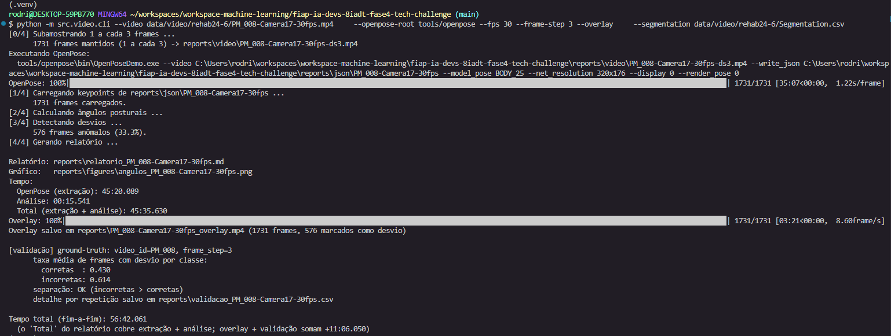

> **Figura 2.** Execução completa do CLI sobre o PM_008 (1.731 frames após subamostragem).
> A saída mostra as quatro fases, os tempos medidos — OpenPose 45:20.089, análise 00:15.541,
> overlay e validação somando +11:06.050, total fim-a-fim 56:42.061 — e a validação contra o
> ground-truth (corretas 0,430 · incorretas 0,614, separação OK). Ao final, lista os quatro
> artefatos gerados: relatório, gráfico, vídeo anotado e CSV de validação por repetição.

### 3.11 Interface Web de Demonstração (`app.py`)

Para uso pela **equipe clínica** e para a demonstração do desafio, o mesmo pipeline é
exposto em uma app web local (Gradio, `python -m src.video.app`, porta 7860). A app não
reimplementa nada: chama as mesmas funções do CLI e gera os mesmos artefatos em `reports/`.

A diferença está na linguagem. Como o público não é técnico, as etapas aparecem por extenso
("Aplicando o Modelo OpenPose", "Overlay (esqueleto sobre o vídeo)"), cada quadro de saída
tem uma legenda dizendo o que vai aparecer nele, e os tempos usam `mm:ss.mi`. Os controles
são quatro: o vídeo (lista montada a partir de `data/video/rehab24-6/*.mp4`), o `frame-step`,
a validação contra o ground-truth e o reaproveitamento de keypoints já extraídos.

A sequência abaixo mostra o fluxo completo do ponto de vista de quem usa a ferramenta.

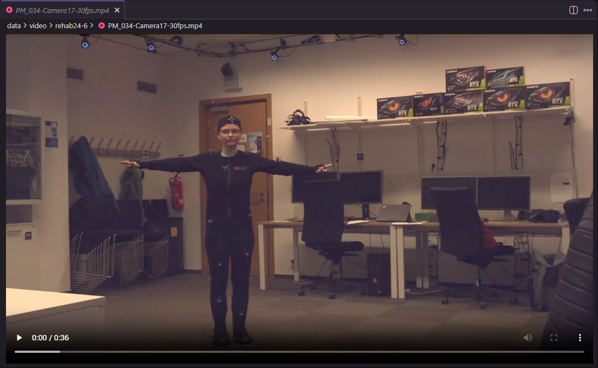

> **Figura 3 — antes.** O material de partida: o vídeo bruto do PM_034 (abdução de perna),
> como a equipe o receberia hoje. A avaliação depende inteiramente da observação visual do
> profissional, sem nenhuma medida objetiva de ângulo ou marcação de instantes suspeitos.

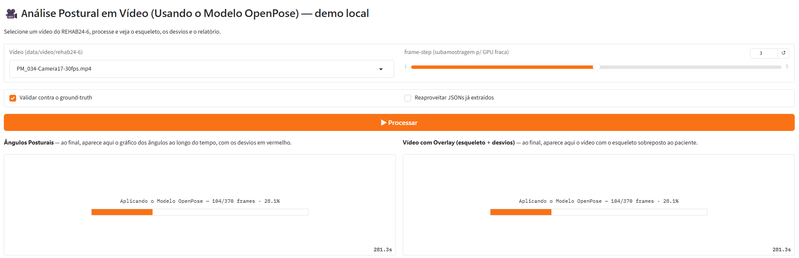

> **Figura 4 — durante.** A app em processamento, com o `frame-step` em 3 e o
> reaproveitamento de keypoints desligado (extração completa). A barra informa a etapa em
> linguagem corrente e o progresso real ("Aplicando o Modelo OpenPose — 104/370 frames"),
> e cada quadro já anuncia o que vai exibir ao terminar.

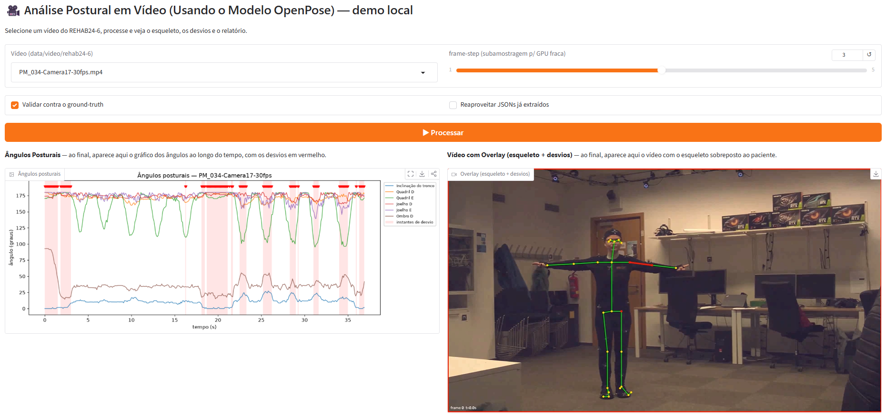

> **Figura 5 — depois.** O mesmo instante da Figura 3, agora processado. À esquerda, os
> ângulos ao longo dos 37 s com as faixas rosa marcando os instantes de desvio; à direita, o
> vídeo com o esqueleto BODY_25 sobreposto, a borda vermelha sinalizando o frame como desvio
> e o osso do ângulo responsável destacado em vermelho (ombro, no frame 0). Abaixo — fora do
> enquadramento — seguem a validação contra o ground-truth e o relatório completo.

### 3.12 Testes

`tests/test_video.py` cobre a entrega com 9 testes sobre **keypoints sintéticos**, sem
exigir o binário do OpenPose nem o dataset baixado: um esqueleto em pé com ruído leve e,
no meio da sequência, frames com o joelho bruscamente flexionado.

Os testes verificam o cálculo dos ângulos, a detecção dos desvios injetados, a estrutura do
relatório e a renderização do overlay. Fixam também as duas decisões que, se revertidas,
corrompem os resultados em silêncio: a **seleção da pessoa principal**, que deve preferir a
figura grande em primeiro plano à pessoa ao fundo (3.5), e o **mapeamento de `frame_step`**,
que converte o índice do frame subamostrado no frame original — sem ele, o cruzamento com
os rótulos do `Segmentation.csv` desalinha e a validação mede a repetição errada (3.8).

---

## 4. Entrega 2 — Análise de Áudio (AWS)

### 4.1 Visão Geral

O pipeline de áudio processa gravações de consultas médicas, transcreve a fala e extrai
os achados clínicos mencionados pelo paciente, produzindo um relatório para a equipe
médica.

```
                                        ┌─► Comprehend Medical ──► achados clínicos ─┐
consulta (.mp3) ──► S3 ──► Transcribe ──┤                                            ├─► relatório
                          (diarização)  └─► Comprehend ──────────► sentimento ───────┘   bilíngue
```

### 4.2 Troca de Provedor: Azure → AWS

O enunciado sugere Azure Cognitive Services. O grupo não dispunha de cota no Azure for
Students e a instituição liberou o uso da **AWS**, para onde o pipeline foi migrado. A
equivalência é direta e, num ponto, favorável:

| Função | Azure (previsto) | AWS (implementado) |
|:--|:--|:--|
| Transcrição | Azure AI Speech | **Amazon Transcribe** |
| Entidades clínicas | Text Analytics for Health | **Amazon Comprehend Medical** |
| Sentimento | Text Analytics | **Amazon Comprehend** (serviço geral) |
| Tradução | — | **Amazon Translate** |

A divisão entre os serviços difere: o Azure Text Analytics reunia sentimento, frases-chave
e entidades de saúde num único serviço, enquanto a AWS separa o **Comprehend Medical**
(entidades clínicas) do **Comprehend** geral (sentimento). São dois clientes distintos, e o
Comprehend Medical **não possui operação de sentimento** — verificado na própria API.

O Comprehend Medical devolve as entidades já **tipadas e qualificadas por traços**
(`NEGATION`, `PERTAINS_TO_FAMILY`, `HYPOTHETICAL`), o que carrega para o serviço parte da
lógica clínica que, de outro modo, teria de ser implementada localmente.

### 4.3 Dataset: Consultas Médicas Simuladas

*A dataset of simulated patient-physician medical interviews with a focus on respiratory
cases* (figshare, DOI 10.6084/m9.figshare.16550013.v1, licença CC0).

| Item | Descrição |
|:--|:--|
| Conteúdo | 272 consultas em formato OSCE, com áudio e transcrição humana revisada |
| Áudio | MP3 16 kHz mono, 11-15 min por consulta |
| Especialidades | 213 respiratórias (78,3%), 46 musculoesqueléticas, 13 outras |
| Rótulos de fala | turnos marcados `D:` (médico) e `P:` (paciente) |
| Licença | CC0 (domínio público) |

**Justificativa da escolha.** O dataset atende às duas exigências do enunciado para a
modalidade: é **áudio de consulta médica** e traz **fala clínica espontânea**, em que o
paciente descreve sintomas em linguagem natural — matéria-prima do Comprehend Medical.
A concentração em casos respiratórios (78,3%) dialoga diretamente com o sintoma-alvo do
desafio, "dificuldades respiratórias e cansaço".

A **transcrição humana revisada** é o que permite medir o erro do Transcribe (4.4) em vez
de apenas exibir seu resultado.

> **Nota sobre a contagem.** O artigo do dataset informa 214 casos respiratórios (78,7%);
> a contagem sobre os arquivos efetivamente distribuídos resulta em **213**. Este
> relatório usa o número medido.

> **Armadilha de codificação.** Dois dos 213 casos respiratórios (`RES0002` e `RES0054`)
> estão em UTF-16, enquanto o restante está em UTF-8. Ler todos como UTF-8 não levanta
> exceção — devolve texto corrompido, e o caso aparece silenciosamente com zero turnos de
> fala. O loader detecta a codificação pelo BOM.

### 4.4 Transcrição (`transcribe.py`)

O Transcribe **não aceita áudio na chamada**: o arquivo vai para o S3, inicia-se um job
assíncrono sobre a URI e busca-se o JSON do resultado. A diarização fica ligada
(`MaxSpeakerLabels=2`), o que permite separar médico e paciente.

**Resultados (quatro consultas).** O WER é medido contra a transcrição humana do próprio
dataset, por distância de edição em nível de palavra.

| Caso | Duração | Especialidade | WER | Sub / Ins / Del | Palavras ref. | Turnos (AWS / humano) | Job |
|:--|--:|:--|--:|:--:|--:|:--:|--:|
| RES0091 | 7,0 min | respiratório | **4,12%** | 12 / 6 / 18 | 873 | 79 / 79 | 93 s |
| RES0029 | 6,7 min | respiratório | **5,37%** | 20 / 16 / 6 | 782 | 65 / 69 | 47 s |
| MSK0018 | 8,6 min | musculoesquelético | **7,53%** | 48 / 14 / 9 | 943 | 73 / 86 | 77 s |
| RES0062 | 17,8 min | respiratório | **10,79%** | 52 / 134 / 20 | 1.910 | 128 / 130 | 108 s |

**WER médio 6,95%** (mediana 6,45%, desvio 2,92%).

**Hesitações ("um", "uh") são removidas dos dois lados**: o anotador humano as transcreveu,
o Transcribe as omite, e contá-las mediria a convenção de anotação, não o reconhecimento. A
diferença é grande e vale registrar — no RES0029, **5,37% sem hesitações contra 13,30% com
elas**.

**Sobre o RES0062, que destoa.** O caso mais longo tem o dobro do WER dos demais, quase
inteiramente por **inserções**: 134, contra 6 a 16 nos outros. Investigando os trechos
inseridos, verifica-se que são **fala real que a transcrição humana omitiu** — orações
inteiras ("and that it's not, you know, a contraindication to your afib"), repetições ("in
your, in your") e falsos começos ("I used to, I..."). A pasta do dataset chama-se *Clean
Transcripts*: o anotador humano **limpou as disfluências**, e o Transcribe transcreveu
literalmente.

A densidade de palavras confirma a leitura:

| Caso | Palavras/min (referência) | Palavras/min (AWS) | Diferença total |
|:--|--:|--:|--:|
| RES0029 | 116 | 118 | +10 |
| RES0091 | 125 | 123 | −12 |
| MSK0018 | 110 | 111 | +5 |
| RES0062 | **107** | **114** | **+114** |

Nos três casos curtos a diferença fica em ±12 palavras; no RES0062 chega a +114, e a
densidade da referência cai enquanto a da AWS se mantém. **O WER mais alto reflete uma
transcrição humana mais editada, não um reconhecimento pior.** É uma limitação do
ground-truth como medida, não do serviço — e sugere que, em consultas longas, o WER contra
transcrição "limpa" superestima o erro real.

**O que o WER não mostra.** A métrica trata todas as palavras como iguais, mas errar
`two`→`2` não tem o mesmo peso clínico que errar `chest pain`. Verificando termo a termo,
os **15 termos clínicos da consulta aparecem com contagem idêntica** nas duas transcrições
— `chest` 5/5, `pain` 10/10, `breath` 5/5, além de `cough`, `fever`, `headache`,
`dizziness`, `stabbing`, `nausea`, `vomiting`, `chills`. Nenhum ausente. Os erros
concentram-se em convenções de escrita (`i'd`→`i would`, `nope`→`no`) e em palavras
funcionais repetidas em trechos com hesitação.

### 4.5 Extração de Entidades Clínicas (`comprehend.py`)

O Comprehend Medical recebe **apenas a fala do paciente** e devolve entidades tipadas. A
restrição é essencial: as perguntas do médico ("any fever?", "do you have a cough?")
contêm termos clínicos, mas são hipóteses sendo investigadas, não achados do paciente.

Na origem humana, a separação vem dos rótulos `D:`/`P:` do dataset; na origem AWS, da
diarização do Transcribe. O papel do paciente é identificado por dois sinais independentes
— quem fala mais e quem *não* abre a consulta — e o código recusa-se a decidir se eles
discordarem, porque trocar os papéis inverteria todo o relatório.

**Resultado (RES0029):** 52 entidades, entre elas:

| Entidade | Traço | Leitura clínica |
|:--|:--|:--|
| `cough`, `infections` | NEGATION | o paciente **negou** |
| `diabetes` | PERTAINS_TO_FAMILY | ocorre em **familiar** |
| `alcohol`, `drugs`, `marijuana` | NEGATION | negativas de uso |
| `left side of my chest` | (anatomia) | localização do sintoma |

Ignorar os traços produziria um relatório listando como sintomas do paciente coisas que
ele negou ou que pertencem a um parente.

**Validação entre as duas origens.** Como existem a transcrição humana e a automática para
a mesma consulta, é possível responder o que o WER não responde: *os erros de transcrição
atrapalham a extração clínica?* Extraindo das duas origens nos quatro casos:

| Caso | Entidades | Achados (humano) | Recuperados | Recall |
|:--|--:|--:|--:|--:|
| RES0091 | 33 | 6 | 5 | 0,833 |
| RES0029 | 52 | 9 | 7 | 0,778 |
| MSK0018 | 55 | 7 | 6 | 0,857 |
| RES0062 | 94 | 14 | 11 | 0,786 |
| **Total** | 234 | **36** | **29** | **0,806** |

A recall mantém-se estável em torno de 0,8 mesmo no RES0062, cujo WER é o dobro dos demais
— indício de que a extração clínica é mais robusta ao erro de transcrição do que a métrica
de palavras sugere.

**Os "não recuperados" são, em maioria, efeito de limiar.** Dos 7 achados ausentes na
origem AWS, **4 estão presentes na extração, apenas com confiança abaixo do corte de
0,70**:

| Achado | Caso | Situação na extração da AWS |
|:--|:--|:--|
| `arm fracture` | RES0091 | presente, score 0,60 |
| `drink` | RES0062 | presente, score 0,66 |
| `haven't been able to smell` | RES0062 | presente, score 0,53 |
| `hurts` | RES0029 | presente, score 0,53 |
| `impact` | RES0029 | ausente (variante de `fell`, que foi recuperado) |
| `shoulder's dropped` | MSK0018 | ausente |
| `throat felt ok.` | RES0062 | ausente |

Ou seja, a recall medida **mistura duas coisas**: a qualidade da transcrição e a
sensibilidade ao limiar escolhido. Um corte mais baixo elevaria a recall e traria também
mais ruído; o valor de 0,70 é uma escolha conservadora, não um ótimo calibrado.

**Falsos positivos observados.** O serviço extrai como achado positivo expressões que
descrevem **ausência de problema** — `head was fine` (RES0029), `throat felt ok.` e
`healthy` (RES0062). São o oposto de um achado clínico, e o traço `NEGATION` não os captura
porque a frase é afirmativa. É a limitação mais relevante encontrada, e o relatório de
saída a mitiga em parte ao exibir o trecho de origem junto de cada achado, permitindo que a
equipe descarte o item em um relance.

### 4.6 Análise de Sentimento (`comprehend.py`)

O enunciado pede a identificação de "termos críticos **e sentimentos**". Os termos vêm do
Comprehend Medical (4.5); o sentimento vem do **Amazon Comprehend** geral, aplicado à fala
do paciente.

A análise é feita em dois níveis: o **tom geral do relato**, com as pontuações ponderadas
pelo tamanho de cada bloco de texto, e o **sentimento por turno de fala**, que localiza
onde o relato é mais negativo.

**Resultados.** Os quatro casos foram classificados como **NEGATIVE**, com a pontuação da
classe negativa entre 0,75 e 0,97:

| Caso | Sentimento | Classe negativa |
|:--|:--|--:|
| RES0062 | NEGATIVE | 0,75 |
| RES0091 | NEGATIVE | 0,88 |
| RES0029 | NEGATIVE | 0,95 |
| MSK0018 | NEGATIVE | 0,97 |

A uniformidade do rótulo entre casos e especialidades é, ela própria, o achado: **o
indicador não discrimina** consultas dentro deste corpus. No RES0029, as três falas de
maior carga negativa são clinicamente pertinentes — a piora recente ("it's been getting
worse", 0,99), o mecanismo do trauma (a queda de bicicleta, 0,96) e a qualidade da dor
("someone is just stabbing me", 0,94) —, o que sugere que a análise **por turno** é mais
informativa que o rótulo agregado.

> **Limitação do indicador.** O modelo de sentimento é de propósito geral, treinado
> sobretudo em avaliações de produtos e redes sociais. Num relato de sintomas, o
> vocabulário de dor e desconforto é intrinsecamente negativo, de modo que **um resultado
> negativo é o esperado numa consulta e, isoladamente, informa pouco**. O indicador ganha
> sentido na **comparação** — entre casos, ou no acompanhamento do mesmo paciente ao longo
> do tempo. Trata-se do sentimento **do texto**, não de uma aferição do estado emocional do
> paciente, e o relatório de saída traz essa ressalva junto do resultado.

### 4.7 Relatório Clínico Bilíngue (`report.py`)

O relatório destina-se à equipe médica e é **bilíngue por necessidade**: o áudio-fonte é em
inglês, e traduzir sem mostrar o original impediria a conferência contra a gravação.
Cada termo e cada trecho aparecem no original seguido da tradução (Amazon Translate, com
cache por trecho).

Estrutura: achados relatados → sintomas negados → história familiar → trechos de apoio →
qualidade da transcrição. Cada achado vem acompanhado da **frase que o originou**, porque
`pain` isolado não informa se é torácica, intensa ou momentânea.

Três ajustes de **segurança clínica** foram necessários após ler a primeira saída como
leitor médico:

1. **Termos afirmados e negados na mesma consulta.** `pain` aparecia nas duas tabelas — o
   paciente tem dor torácica (queixa principal) e negou dor em outro local. Listar "dor:
   negada" ao lado da queixa principal poderia levar ao seu descarte. Havendo conflito, o
   achado afirmado prevalece e um aviso nomeia os termos ambíguos para verificação.
2. **História familiar entre os achados do paciente.** `diabetes` aparecia como achado
   próprio; o filtro excluía hipotéticos, mas não `PERTAINS_TO_FAMILY`.
3. **Tradução ambígua.** `drugs` era traduzido como "medicamentos", enquanto o tipo é
   `REC_DRUG_USE`; a tabela de negações passou a exibir o tipo.

O relatório informa também o **WER da transcrição que originou os achados**: extração
perfeita sobre transcrição ruim continua sendo informação ruim, e a equipe precisa desse
contexto para calibrar a confiança.

### 4.8 Ferramenta de Linha de Comando (`cli.py`)

O `cli.py` é o **único ponto de entrada** da entrega: executa as quatro etapas na ordem em
que dependem umas das outras e grava o relatório final. Os demais módulos
(`transcribe.py`, `comprehend.py`, `report.py`) são bibliotecas sem interface de linha de
comando — mesma organização da Entrega 1, onde apenas `cli.py` e `app.py` são executáveis.

```bash
python -m src.audio.cli --case RES0062
```

**Parâmetros.**

| Parâmetro | Padrão | Função |
|:--|:--|:--|
| `--case` / `--cases` | — | um caso ou vários (mutuamente exclusivos) |
| `--root` | `data/audio/consultas` | raiz do dataset |
| `--force` | desligado | reprocessa mesmo com cache — **cobra novamente** |
| `--no-compare` | desligado | não extrai entidades da transcrição da AWS (metade do custo da etapa 2) |
| `--no-translate` | desligado | gera o relatório sem chamar o Amazon Translate |
| `--keep-fillers` | desligado | conta hesitações no WER |
| `--dry-run` | desligado | lista o que faria chamada paga, sem executar |
| `--report` | — | recalcula as métricas do cache, **sem chamar a AWS** |
| `--show-entities` | — | lista as entidades já extraídas de um caso |
| `--out` | — | CSV com o resumo dos casos |

**Saída.** Cada etapa concluída informa o **serviço AWS** que a executou e o resultado
obtido; ao final vêm os tempos por etapa no formato `mm:ss.mi`, o mesmo da Entrega 1.

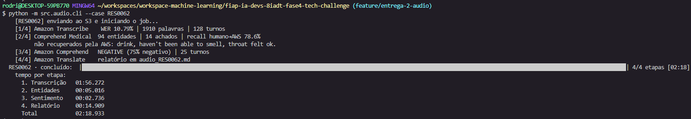

> **Figura 6.** Pipeline completo sobre o RES0062 (17,8 min de consulta). As quatro etapas
> nomeiam o serviço que as executou — Transcribe, Comprehend Medical, Comprehend e
> Translate —, e a barra de progresso conta etapas concluídas. A transcrição domina o
> tempo (01:56 de 02:18 totais), o que é esperado: é a única etapa que processa o áudio
> inteiro. Note que os achados não recuperados pela extração sobre a transcrição
> automática aparecem nomeados na própria saída, sem exigir consulta ao relatório.

A barra de progresso conta **etapas concluídas**, e não percentual dentro da transcrição:
a API do Transcribe informa apenas `IN_PROGRESS` ou `COMPLETED`, sem progresso parcial.
Estimar o total pela duração do áudio também não se sustenta — 6,7 min de áudio levaram
47 s e 7,0 min levaram 93 s. Durante a espera, exibe-se o tempo decorrido, que é
informação verdadeira. Isso difere da Entrega 1, onde o `tqdm` tem sinal real: o OpenPose
escreve um JSON por frame, e basta contá-los.

**Modo de consolidação.** O `--report` recalcula as métricas de todos os casos já
transcritos sem tocar na AWS, produzindo a estatística agregada usada em 4.4:

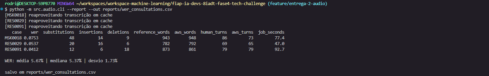

> **Figura 7.** Modo `--report`: as quatro transcrições são lidas do cache (nenhuma chamada
> paga é feita) e as métricas, recalculadas. Permite iterar sobre a forma de medir — por
> exemplo, ligar e desligar a contagem de hesitações — sem pagar novamente pela
> transcrição. É também a origem do `wer_consultations.csv` versionado no repositório.

### 4.9 Controle de Custo e Credenciais

Transcribe, Comprehend Medical e Translate cobram por volume processado. Todo resultado é
**cacheado em disco** (`reports/transcriptions/`, `reports/entities/`,
`reports/translations.json`) e nenhum caso é reprocessado sem `--force`. O modo `--report`
recalcula métricas a partir do cache **sem tocar na AWS**, permitindo iterar sobre a
métrica sem custo. Os JSON brutos da AWS são versionados, de forma que os resultados podem
ser auditados sem credenciais.

As credenciais ficam em `~/.aws/credentials` (via `aws configure`); o `.env` guarda apenas
região e nome do bucket, sem segredos. O comando `python -m src.common.config` verifica o
ambiente antes de qualquer chamada paga.

---

## 5. Entrega 3 — Detecção de Anomalias

### 5.1 Visão Geral

O pipeline de anomalias monitora três séries do paciente internado — **sinais vitais**,
**evolução da dose prescrita** e **padrões de movimentação** — e sinaliza os instantes que
fogem do padrão esperado, produzindo o insumo da camada de alerta.

A decisão de arquitetura central: **o modelo aprende apenas o padrão de normalidade e é
aplicado a séries que não participaram do treino**. Em ambos os detectores a coorte de
treino é restrita ao comportamento esperado — só atividades de repouso, na movimentação;
só pacientes que nunca desenvolveram sepse, nos vitais — e os rótulos do dataset entram
exclusivamente na avaliação. O modelo treinado é persistido, o que permite pontuar um
paciente por vez, como o sistema operaria em leito.

```
TREINO (uma vez)     padrão de normalidade ──► models/*.joblib (modelo + limiar)
INFERÊNCIA (por pac.) série de um indivíduo ──► instantes em alerta
```

| Subtarefa | Dataset | Ground-truth | Modelo |
|:--|:--|:--|:--|
| Movimentação | UCI HAR | atividade real | IsolationForest treinado em repouso |
| Sinais vitais | Challenge 2019 | `SepsisLabel` | IsolationForest sobre desvios por paciente |
| Prescrições | Challenge 2019 (derivada) | `SepsisLabel` | regra de degrau na dose |

### 5.2 Datasets

**Sinais vitais e prescrições — PhysioNet/CinC Challenge 2019.**

| Item | Descrição |
|:--|:--|
| Fonte | [physionet.org/content/challenge-2019/1.0.0](https://physionet.org/content/challenge-2019/1.0.0/) |
| Acesso | Aberto, sem credenciamento |
| Conteúdo | 40.336 pacientes de UTI, um arquivo `.psv` por paciente, uma linha por hora |
| Variáveis | 8 sinais vitais, 26 laboratoriais, 6 de demografia |
| Rótulo | `SepsisLabel` (0/1) — deterioração clínica confirmada |
| Licença | Open Data Commons ODbL 1.0 |

**Movimentação — UCI HAR (Human Activity Recognition).**

| Item | Descrição |
|:--|:--|
| Fonte | [archive.ics.uci.edu/dataset/240](https://archive.ics.uci.edu/dataset/240/human+activity+recognition+using+smartphones) |
| Acesso | Aberto, sem credenciamento |
| Conteúdo | 10.299 janelas de acelerômetro e giroscópio, 30 sujeitos |
| Variáveis | 561 features já extraídas por janela |
| Rótulos | 6 atividades: `WALKING`, `WALKING_UPSTAIRS`, `WALKING_DOWNSTAIRS`, `SITTING`, `STANDING`, `LAYING` |
| Licença | CC BY 4.0 |

**Justificativa da escolha.** Ambos são abertos e trazem rótulo utilizável como
*ground-truth*, o que permite medir a detecção em vez de apenas exibi-la. O Challenge 2019
foi preferido ao MIMIC-IV, mais rico, porque este exige curso CITI e Data Use Agreement,
com tramitação incompatível com o prazo do trabalho.

> **Nota de acesso.** Os arquivos `training_setA.zip` e `training_setB.zip` citados na
> documentação do PhysioNet **não existem mais** — respondem 404, e os dados passaram a ser
> servidos individualmente, um `.psv` por paciente. O download por HTTP exigiria 40.336
> requisições. O caminho usado é o espelho público em S3:
> `aws s3 sync --no-sign-request s3://physionet-open/challenge-2019/1.0.0/training/`.

> **Os dois datasets não descrevem os mesmos indivíduos.** Não existe correspondência entre
> um paciente do Challenge 2019 e um sujeito do UCI HAR. É a prática usual quando cada
> modalidade tem sua fonte aberta, mas tem uma consequência concreta no sistema: o
> monitoramento de um paciente de UTI reúne sinais vitais e dose prescrita, que vêm da mesma
> fonte, enquanto a movimentação é monitorada por sujeito, em comando separado (5.6).

### 5.3 Movimentação do Paciente (`movement.py`)

**Enquadramento.** Durante a internação, o esperado é o paciente em repouso — deitado,
sentado ou em pé parado. Marcha, sobretudo subir e descer escada, é movimentação
inesperada em leito e deve gerar alerta.

O modelo é treinado **apenas** nas 4.067 amostras de repouso do conjunto de treino e nunca
vê marcha; as três atividades de marcha do conjunto de teste funcionam como *ground-truth*
de anomalia. Os 30 sujeitos são divididos pelo próprio dataset em 21 para treino e 9 para
teste, sem sobreposição.

**Resultados quantitativos.** Sobre as 2.947 amostras de teste, com
`contamination = 0.05` e `random_state = 42`:

| Métrica | Valor |
|:--|:--:|
| Precisão | 0,947 |
| Recall | 1,000 |
| F1 | 0,973 |
| AUC | 0,9999 |
| Falso alarme sobre repouso | 5,00% (78 de 1.560) |

A taxa de alerta por atividade real mostra onde o detector acerta e onde erra:

| Atividade | Classe | Taxa de alerta |
|:--|:--|:--:|
| `WALKING` | movimento | 100,0% |
| `WALKING_UPSTAIRS` | movimento | 100,0% |
| `WALKING_DOWNSTAIRS` | movimento | 100,0% |
| `STANDING` | repouso | 7,0% |
| `LAYING` | repouso | 4,5% |
| `SITTING` | repouso | 3,5% |

A separação é praticamente completa: **nenhuma das 1.387 amostras de marcha escapou**, e o
custo é um alarme falso a cada vinte leituras de repouso — proporção controlada pelo
parâmetro de contaminação. Um paciente que deveria estar em repouso e começa a deambular é
detectado sem exceção.

O erro se concentra em `STANDING` (7,0%), o dobro de `SITTING` (3,5%). É coerente com a
natureza do sinal: estar em pé parado envolve micro-oscilações de equilíbrio que aproximam
a leitura do início de uma marcha, enquanto deitado e sentado são posturas estáveis.

### 5.4 Sinais Vitais (`vitals.py`)

O detector opera sobre os 8 sinais vitais horários, com três decisões de modelagem.

**Normalização contra a linha de base do próprio paciente.** Um IsolationForest ajustado
sobre os valores brutos aprende "o que é raro na população", e não "o que mudou neste
paciente" — que é a pergunta do alerta de leito. Cada série vira desvio robusto (z-score
por mediana e MAD) contra as primeiras 8 horas daquele paciente, a mesma técnica da
Entrega 1 (3.7).

**Coorte de treino restrita à normalidade.** A separação treino/teste é feita **por
paciente**, e o treino recebe apenas pacientes que nunca desenvolveram sepse — mantê-los
ensinaria ao modelo que a deterioração faz parte do padrão normal.

**Limiar absoluto.** O corte é o percentil 5 dos *scores* do treino, guardado junto com o
modelo. A alternativa — sinalizar as 5% piores horas *de cada paciente* — foi implementada
e descartada: com corte individual, todo paciente recebe alertas por construção, inclusive
o estável, e a taxa deixa de ser comparável entre pacientes.

**Resultados quantitativos.** Sobre 5.000 pacientes — 3.187 sem sepse no treino, 1.813
retidos para teste (76.888 horas, 446 com sepse):

| Métrica | Valor |
|:--|:--:|
| AUC | 0,555 |
| AUPRC | 0,068 (prevalência horária 0,056) |
| Avisados na janela de 48 h que antecede o início | 111 de 446 |
| Antecedência mediana do aviso | 30 horas |

O desempenho hora a hora é **fraco** — a AUC fica pouco acima do acaso. Os sinais vitais
isolados não separam bem a hora de sepse da hora estável; o valor prático aparece no nível
do paciente, quando o alerta ocorre com antecedência útil. Só contam alertas nas 48 horas
anteriores ao início: medir a partir do primeiro alerta da internação inteira produziria
"antecedências" de centenas de horas para eventos sem relação com o alerta.

**Onde está o sinal.** Para verificar se o desempenho fraco vem do método ou das
variáveis, o mesmo modelo foi aplicado a três conjuntos de features:

| Conjunto | Nº features | AUC | AUPRC |
|:--|:--:|:--:|:--:|
| Sinais vitais | 7 | 0,571 | 0,029 |
| Marcadores de laboratório | 8 | 0,628 | 0,034 |
| Vitais + laboratório | 15 | 0,628 | 0,035 |

Os marcadores de laboratório discriminam melhor **apesar de terem cobertura muito menor**
— de 4% a 14% das horas, contra 83% a 91% dos vitais. É coerente com a prática clínica:
lactato e leucócitos são marcadores diretos de sepse, enquanto a alteração dos vitais é
tardia. A entrega mantém os vitais como objeto, conforme o escopo, e registra a comparação
como limitação medida.

**Limitações medidas.**

- **Menos da metade dos pacientes com sepse é avisada na janela** (111 de 446), consequência
  do limiar absoluto, que não garante alerta para todo paciente. Baixá-lo aumenta a
  cobertura ao custo de mais alarme falso.
- **A agregação multivariada dilui o desvio de uma variável isolada.** O paciente
  `p000188` (Figura 12) tem a frequência respiratória subindo de 16 para 33 ao longo da
  internação — uma deterioração inequívoca. A normalização por paciente **captura** esse
  movimento: o z-score mediano da `Resp` vai de −0,67 nas primeiras 40 horas para 4,89 no
  bloco que antecede o início da sepse, com pico de 8,09. O alerta, porém, não dispara: o
  IsolationForest avalia as 7 variáveis em conjunto, e um ponto extremo em um único eixo,
  com os outros seis dentro da faixa, não se isola no espaço multivariado. O score mais
  anômalo do paciente fica em −0,4423 contra um limiar de −0,4694 — a **0,027** de
  disparar. O sinal existia e foi medido; perdeu-se na agregação.

- **`EtCO2` tem 0% de cobertura no *training set A*** (7,6% no *set B*) — consta do schema
  e nunca é medida. É descartada automaticamente; mantida, entraria como constante.
- **O `SepsisLabel` marca a janela em que a sepse é considerada instalada**, não "hora
  anormal": um alerta fora dela não é necessariamente falso. A precisão hora a hora é
  conservadora por construção.

### 5.5 Evolução de Prescrições (`prescriptions.py`)

Não existe fonte pública aberta e granular de prescrições hospitalares — a referência é o
MIMIC-IV, que exige credenciamento. A subtarefa usa, no lugar, a **`FiO2`** (fração
inspirada de oxigênio) do próprio Challenge 2019: ao contrário dos demais campos, que são
*medições* do paciente, a FiO2 é um valor **prescrito e titulado pela equipe**, e sua série
ao longo das horas é uma série de doses. A alternativa era gerar dados sintéticos com o
Synthea, que exige Java JDK e geração local e demanda a mesma ressalva.

**Detecção.** Anomalia é um degrau de 0,15 ou mais entre coletas consecutivas, numa escala
que vai de 0,21 (ar ambiente) a 1,0. Apenas **aumentos** alertam: reduzir a dose indica
que o paciente precisa de menos suporte, isto é, melhora. O dataset mistura duas notações — percentual (21 a 100) e fração (0,21 a
1,0) — e o loader converte tudo para fração antes de medir a variação.

**Resultados quantitativos.** Sobre os mesmos 5.000 pacientes, dos quais 2.942 têm ao menos
três registros de dose (cobertura da FiO2: 14,2% das horas), foram detectados 963
escalonamentos e 2.374 reduções de dose:

| Grupo | Desenvolveram sepse |
|:--|:--:|
| Escalonaram a dose | 17,9% |
| Não escalonaram | 10,5% |

O sinal é modesto mas consistente: escalonar a oferta de oxigênio **quase dobra** a
probabilidade de o paciente desenvolver sepse.

> **É uma proxy de prescrição, não a prescrição de prontuário.** O escalonamento de
> oxigênio é uma decisão terapêutica real e registrada, mas cobre um único eixo do que uma
> base de prescrições traria: não há classe de medicamento, posologia nem interações. A
> subtarefa demonstra o método sobre série de doses; a generalização para prescrição
> farmacológica depende de fonte que o projeto não teve.

### 5.6 Monitoramento de um Indivíduo (`cli.py`)

Os modelos treinados são persistidos em `models/` e aplicados a séries individuais. Como os
dois datasets não descrevem os mesmos indivíduos (5.2), o monitoramento tem dois comandos:

```bash
python -m src.anomaly.cli --train                 # treina e salva os dois detectores
python -m src.anomaly.cli --monitor p001123       # vitais + prescrições de um paciente
python -m src.anomaly.cli --monitor-subject 2     # movimentação de um sujeito
```

O primeiro reúne as duas subtarefas do Challenge 2019, que descrevem o mesmo paciente; o
segundo cobre a movimentação. Em ambos, o modelo não viu o indivíduo durante o treino, e o
rótulo é exibido apenas na seção de conferência — nunca entra na pontuação.

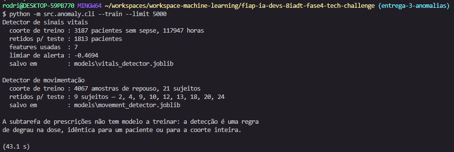

> **Figura 8.** Treino sobre 5.000 pacientes, em 43,1 s. Cada detector recebe a sua coorte
> de normalidade: 3.187 pacientes sem sepse (117.947 horas) para os sinais vitais e 4.067
> amostras de repouso para a movimentação. A saída informa o que foi retido para teste —
> 1.813 pacientes e 9 sujeitos, estes últimos identificados um a um — e o limiar de alerta
> aprendido (−0,4694), que é guardado junto com o modelo. Das 8 colunas de sinais vitais,
> 7 entram no modelo: a `EtCO2` é descartada por não ter cobertura (5.4).

**Caso 1 — os sinais vitais detectam (`p001123`).**

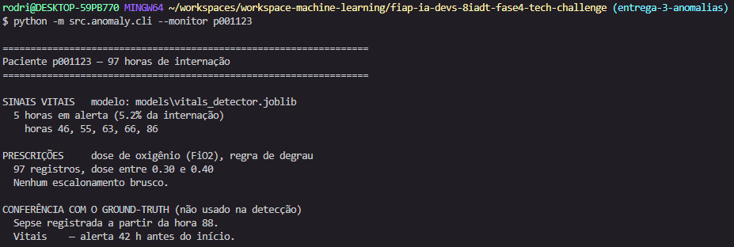

> **Figura 9.** Paciente retido do conjunto de teste. O detector sinaliza 5 das 97 horas
> (5,2%) — 46, 55, 63, 66 e 86 — e a conferência mostra sepse registrada a partir da hora
> 88, ou seja, **42 horas de antecedência**. Note que os alertas se adensam à medida que o
> evento se aproxima. A dose prescrita foi monitorada (97 registros, entre 0,30 e 0,40) e
> não apresentou escalonamento brusco: aqui quem avisa são os vitais.

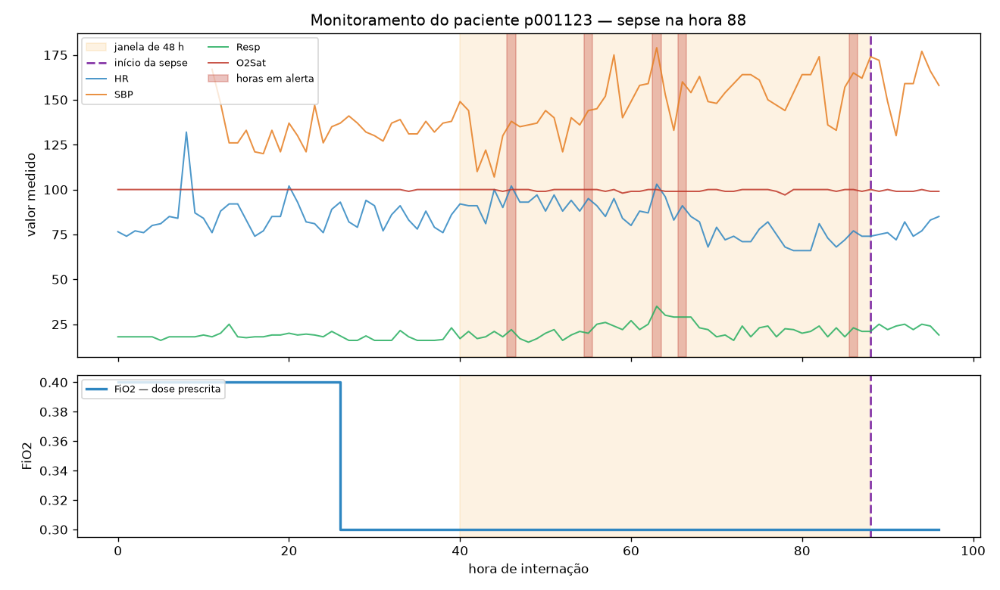

> **Figura 10.** A mesma execução em série temporal. A faixa laranja é a janela de 48 h que
> antecede o início da sepse (linha roxa tracejada, hora 88) e as faixas vermelhas marcam
> as horas em alerta: **todas caem dentro da janela**. O painel inferior mostra a dose
> de oxigênio, estável em 0,30 desde a hora 26 — sem escalonamento, coerente com a saída do
> comando.

**Caso 2 — os sinais vitais silenciam e a prescrição detecta (`p000188`).**

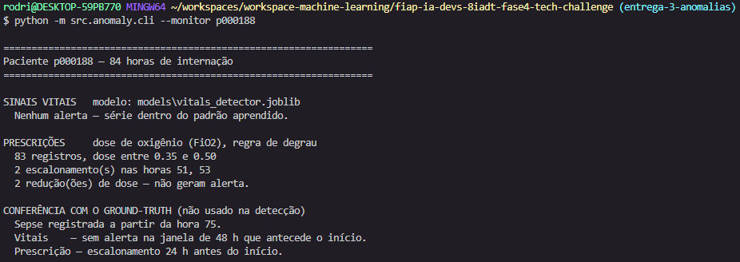

> **Figura 11.** O mesmo modelo, sobre outro paciente retido, não emite **nenhum** alerta
> nas 84 horas de internação, embora o paciente desenvolva sepse na hora 75. A subtarefa de
> prescrições, no entanto, registra dois escalonamentos de FiO2 — horas 51 e 53 —, o
> primeiro deles **24 horas antes** do início. As duas reduções de dose detectadas não
> geram alerta, por indicarem melhora.

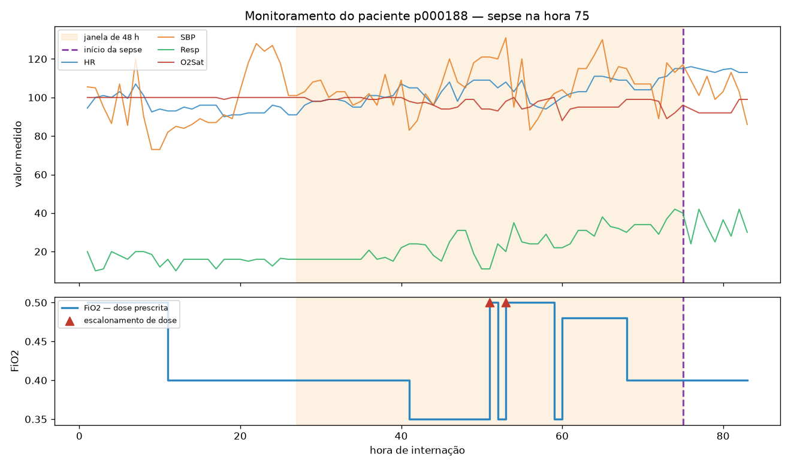

> **Figura 12.** O mesmo paciente em série temporal. Não há nenhuma faixa vermelha no painel
> superior — o detector de vitais ficou em silêncio —, enquanto os dois triângulos do painel
> inferior marcam os escalonamentos de dose nas horas 51 e 53, ambos dentro da janela. A
> figura expõe algo que a saída de texto não mostra: a frequência respiratória (verde) sobe
> de forma contínua ao longo da internação, uma deterioração visível que o alerta não
> capturou. A seção 5.4 detalha por quê.

O contraste entre as Figuras 9 e 10 é a ilustração concreta do que a comparação de features
da seção 5.4 indicou de forma agregada: a alteração dos sinais vitais é tardia, e outras
séries do mesmo paciente podem avisar antes. É também o argumento para que a camada de
alerta combine as modalidades em vez de depender de uma só (5.7).

**Movimentação.**

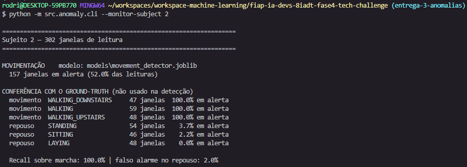

> **Figura 13.** Sujeito 2 do conjunto de teste, 302 janelas de leitura. O detector sinaliza
> 157 delas (52,0%), e a conferência mostra por quê: as três atividades de marcha são
> detectadas **integralmente** (100,0% cada), enquanto o repouso permanece quase todo em
> silêncio — `LAYING` sem nenhum alerta, `SITTING` em 2,2% e `STANDING` em 3,7%. O recall
> sobre marcha é de 100,0% com 2,0% de falso alarme no repouso, coerente com os números
> agregados da seção 5.3.

### 5.7 Geração de Alertas

Os instantes sinalizados alimentam a camada de alerta descrita na Seção 6. A execução
completa das três subtarefas produz, além do relatório para a equipe médica, o conjunto de
métricas que orienta o peso de cada modalidade:

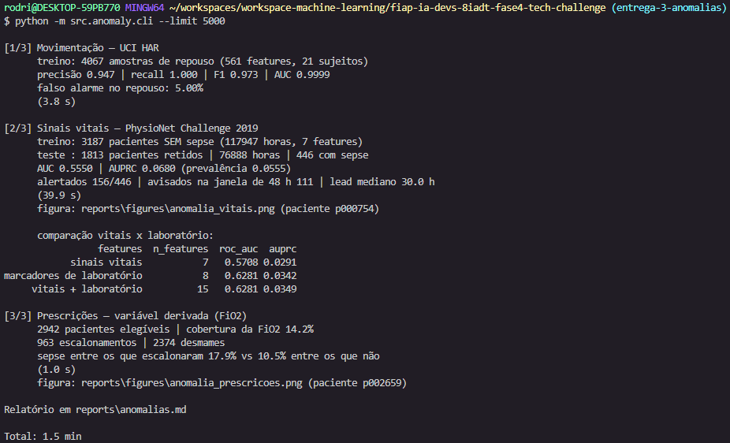

> **Figura 14.** Avaliação sobre 5.000 pacientes, em 1,5 min. As três subtarefas aparecem
> lado a lado com os respectivos tempos: movimentação (4,1 s), sinais vitais (39,2 s) e
> prescrições (0,8 s) — o restante do tempo é a leitura dos 5.000 arquivos `.psv`. A saída
> explicita a separação treino/teste dos vitais (3.187 pacientes sem sepse no treino contra
> 1.813 retidos) e inclui a comparação entre vitais e marcadores de laboratório discutida
> em 5.4.

Os resultados sugerem **pesos distintos por modalidade**, e não um limiar comum:

- **Movimentação** (AUC 0,9999) — a separação entre marcha e repouso é praticamente
  completa, com falso alarme conhecido e ajustável. Precisão suficiente para alerta
  automático.
- **Prescrições** — sinal fraco mas consistente, e derivado de uma decisão terapêutica
  explícita. Adequado como fator de risco agregado, não como gatilho isolado.
- **Sinais vitais** (AUC 0,555) — deve ser tratado como **triagem para revisão humana**, e
  não como diagnóstico. A antecedência mediana de 30 horas é clinicamente útil quando o
  alerta ocorre, mas menos da metade dos pacientes com sepse é avisada dentro da janela.

**Por que os desempenhos são tão diferentes.** A distância entre AUC 0,9999 e 0,555 não
decorre de diferença de implementação — o modelo, o `random_state` e o parâmetro de
contaminação são os mesmos. Marcha e repouso são estados fisicamente distintos, medidos por
sensores de alta frequência e cobertura quase total: a fronteira entre as classes é nítida
no espaço de features. Deterioração clínica é um processo lento e contínuo, ao qual o
`SepsisLabel` impõe um corte binário, medido por variáveis esparsas e de reação tardia.

O ponto relevante para o sistema é que **um mesmo baseline não-supervisionado produz
qualidade muito diferente conforme a modalidade**. Reportar apenas a subtarefa mais
favorável daria uma impressão falsa da confiabilidade do monitoramento como um todo.

**A fila de plantão (`alerts.py`).** É a camada que transforma anomalia em alerta
acionável: varre a coorte retida e ordena os pacientes por prioridade.

| Prioridade | Condição |
|:--|:--|
| ALTA | sinais vitais **e** dose prescrita alteraram |
| MEDIA | apenas uma das duas séries alterou |

A regra de prioridade máxima é a **corroboração**: são medições independentes, e a
concordância entre elas carrega informação que nenhuma traz sozinha. Dentro da mesma
prioridade, ordena-se pelo alerta mais recente.

A fila expõe também a **taxa de alerta** (horas sinalizadas sobre horas de internação),
porque a ordenação sozinha não distingue o evento agudo do paciente cronicamente fora do
padrão. Na coorte de 1.000 pacientes há casos em alerta 86% da internação: são pacientes
para os quais o detector perde valor discriminante, e que sem essa coluna ocupariam o topo
da fila com a mesma aparência de quem disparou três vezes em cem horas. O sistema **não**
os rebaixa automaticamente — expõe o número para a decisão humana, coerente com o papel de
triagem descrito acima.

### 5.8 Interface Web de Demonstração (`app.py`)

As três subtarefas são expostas em uma app web local (Gradio,
`python -m src.anomaly.app`, porta 7861 — ao lado da porta 7860 da Entrega 1, para que as
duas fiquem abertas na demonstração). Como na Entrega 1, a app **não reimplementa nada**:
chama as mesmas funções que o CLI usa. O equivalente em terminal é
`python -m src.anomaly.cli --alerts` para a fila e `--monitor-subject` para a movimentação.

A app tem **duas abas, uma por fonte de dados**, e a separação não é decisão de layout: os
pacientes do Challenge 2019 e os sujeitos do UCI HAR não são as mesmas pessoas (5.2). Uma
fila única sugeriria que o hospital monitora as três séries do mesmo paciente, o que a
origem dos dados não sustenta. O texto de cada aba declara de onde vêm os dados, e a
unidade muda junto: *paciente* em uma, *sujeito* na outra.

A diferença está no gesto que a interface permite. No terminal, ver a fila e abrir um
paciente são dois comandos desconectados; na app, **clicar numa linha abre a série daquele
paciente** — que é o gesto do plantonista ao decidir se um alerta merece atenção. A coorte
é pontuada uma vez e mantida em memória, de modo que abrir cada paciente é imediato; sem
isso, cada clique custaria a releitura dos arquivos.

Abaixo da fila há uma **legenda** com as siglas (`HR`, `SBP`, `Resp`, `O2Sat`, `FiO2`) e
suas faixas usuais de adulto. O público da tela é a equipe clínica, e sem as faixas de
referência o gráfico não se lê de relance — ver a frequência respiratória subir de 16 para
33 só significa alguma coisa para quem sabe que o usual é 12 a 20.

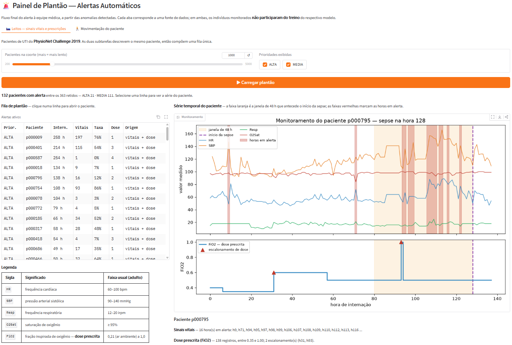

> **Figura 15.** A app com a coorte já processada e um paciente aberto. À esquerda, a fila
> de plantão: 132 pacientes com alerta entre os 363 retidos (21 de prioridade ALTA, 111
> MEDIA), ordenados por prioridade e, dentro dela, pelo alerta mais recente. A coluna
> **Taxa** é o que distingue o evento agudo do paciente cronicamente fora do padrão —
> compare o `p000754` (86% da internação em alerta) com o `p000795` (12%). À direita, a
> série do paciente selecionado: as faixas vermelhas são as horas em alerta, a faixa
> laranja é a janela de 48 h que antecede o início da sepse (linha roxa, hora 128) e os
> triângulos do painel inferior marcam os escalonamentos de dose. No `p000795` as duas
> séries convergem — a dose escalona na hora 93 e os sinais vitais passam a alertar a
> partir da hora 94, ambos dentro da janela. Abaixo do gráfico, a leitura do caso e a
> conferência contra o `SepsisLabel`, que **não** participa da detecção.

Os controles da aba de leitos são dois: o tamanho da coorte (200 a 5.000 pacientes) e
quais prioridades exibir. O filtro de prioridade não repontua nada — opera sobre a fila já
em memória.

A segunda aba monitora a **movimentação**, por sujeito. A visualização aqui é diferente da
Figura 9: em vez da taxa de alerta agregada por atividade, mostra a **sequência** — cada
janela de leitura vira uma coluna, com a atividade real em cima e o alerta embaixo.

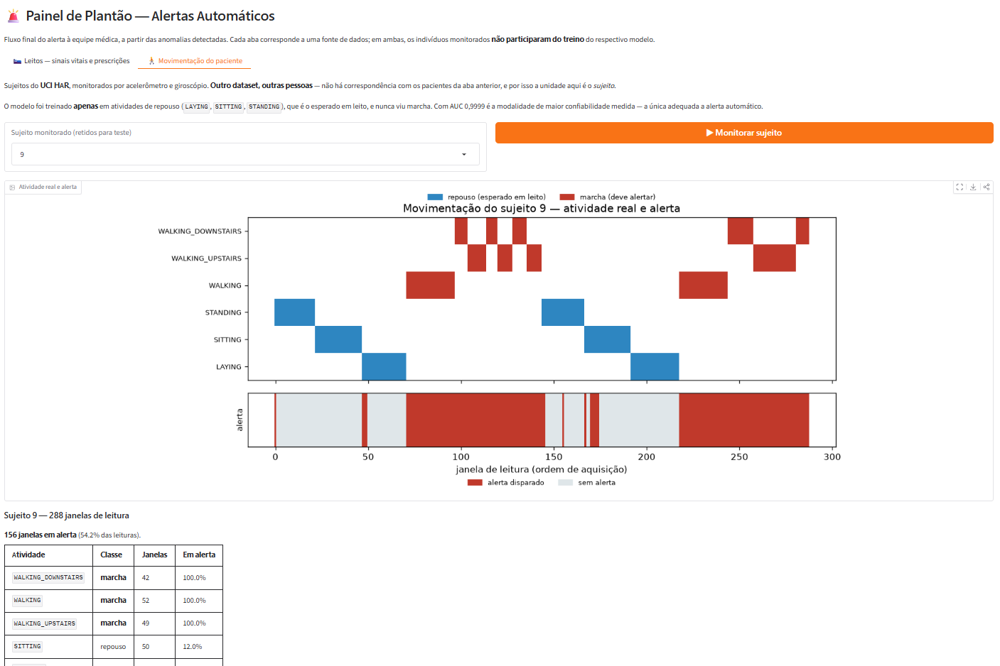

> **Figura 16.** Sujeito 9 do conjunto de teste, 288 janelas de leitura. No painel
> superior, a atividade real, azul para repouso e vermelha para marcha; no inferior, uma
> faixa contínua em que vermelho indica alerta disparado e cinza, silêncio. A
> correspondência entre os dois painéis é o resultado: os quatro blocos de marcha acendem
> **por inteiro**, e as regiões de repouso ficam quase todas cinza. Os riscos vermelhos
> isolados sobre o fundo cinza são os falsos alarmes — 12,0% em `SITTING`, 8,9% em
> `STANDING` e 6,0% em `LAYING` neste sujeito, acima da média de 5,00% do conjunto (5.3),
> o que mostra que a taxa varia entre indivíduos. A tabela abaixo do gráfico traz o
> **total** de janelas por atividade, não a posição no eixo.

### 5.9 Testes

`tests/test_anomaly.py` cobre a entrega com 25 testes sobre séries sintéticas, sem exigir
os datasets baixados. Além do caminho feliz, os testes fixam as decisões que, se revertidas,
produzem números melhores do que a realidade sem levantar erro: a separação entre treino e
teste (nenhum paciente aparece nos dois, nenhum paciente séptico entra no treino), a
identidade entre o modelo salvo e o recarregado, a exigência de que embaralhar o
`SepsisLabel` não altere nenhum alerta, a janela do cálculo de antecedência, a normalização
de escala da FiO2 e a redução de dose que não deve alertar.

A fila de plantão tem testes próprios: a regra de corroboração, a identificação da origem
do alerta, a ordenação por prioridade, o cálculo da taxa que separa o caso agudo do
crônico, e a exigência de que a ressalva "não constituem diagnóstico" apareça na tela — não
basta estar no relatório, precisa estar diante de quem decide.

---

## 6. Integração em Nuvem (AWS) e Fluxo de Alerta

O enunciado exige integração com serviços gerenciados em nuvem. O projeto usa **três
serviços da AWS**, todos na Entrega 2, com o processamento das demais modalidades
executado localmente.

### 6.1 Serviços Utilizados

| Serviço | Papel | Estado |
|:--|:--|:--|
| **Amazon S3** | armazenamento do áudio — o Transcribe não aceita upload direto | Em uso |
| **Amazon Transcribe** | transcrição da fala, com diarização de 2 falantes | Em uso |
| **Amazon Comprehend Medical** | extração de entidades clínicas tipadas (`DetectEntitiesV2`) | Em uso |
| **Amazon Comprehend** | análise de sentimento do relato (`DetectSentiment`) | Em uso |
| **Amazon Translate** | tradução dos achados para o relatório bilíngue | Em uso |

Região: `us-east-1`. A escolha não é indiferente — o **Comprehend Medical não está
disponível em todas as regiões**, e o comando de verificação do ambiente confere isso
antes de qualquer chamada.

### 6.2 O que Roda Local, e por quê

| Modalidade | Processamento | Justificativa |
|:--|:--|:--|
| Vídeo (Entrega 1) | OpenPose local | Não há serviço gerenciado equivalente para pose clínica; a extração de keypoints é feita pelo binário do OpenPose |
| Anomalias (Entrega 3) | IsolationForest local | Ver nota abaixo |

**Nota sobre serviços gerenciados de anomalia.** Os dois serviços que seriam o encaixe
natural para séries temporais foram descontinuados pelos respectivos provedores:

- **Azure Anomaly Detector** — não permite criar novos recursos desde 20 de setembro de
  2023, com retirada completa prevista.
- **Amazon Lookout for Metrics** — **suporte encerrado em 10 de outubro de 2025**; o
  serviço deixou de ser acessível pelo console e pela API, e a AWS orienta migrar para
  CloudWatch, OpenSearch, Redshift ML ou QuickSight.

A Entrega 3 permanece, portanto, com detecção local (IsolationForest). A decisão não
decorre de preferência técnica, mas do fato de que **os serviços gerenciados dedicados a
essa função foram retirados do mercado pelos dois provedores**. Uma alternativa gerenciada
ainda viável seria a detecção de anomalias do **Amazon CloudWatch**, voltada a métricas
operacionais — encaixe possível, porém menos direto para séries clínicas multivariadas com
rótulo de deterioração.

### 6.3 Evidência de Uso

Os serviços deixam rastro auditável no console da AWS, o que permite verificar a
integração de forma independente do código:

| Serviço | Onde verificar |
|:--|:--|
| Transcribe | Console → Amazon Transcribe → *Transcription jobs* (nome, status, idioma, horário) |
| S3 | Console → S3 → bucket → prefixo `consultations/` |
| Comprehend Medical | Console → CloudTrail → *Event history*, filtrando por `comprehendmedical.amazonaws.com` |
| Métricas do Transcribe | CloudWatch → namespace `AWS/Transcribe` (18 métricas, incluindo `AudioDurationTime`) |

O Comprehend Medical **não publica métricas no CloudWatch** (o namespace
`AWS/ComprehendMedical` permanece vazio); sua evidência de uso está no CloudTrail, que
registra cada chamada `DetectEntitiesV2`.

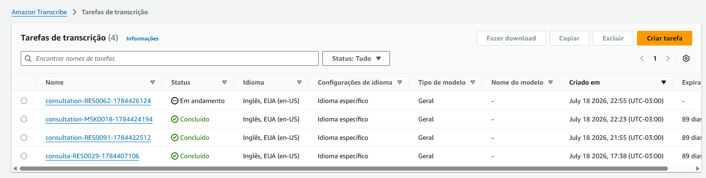

> **Figura 17.** Console do Amazon Transcribe com as quatro tarefas submetidas por este
> trabalho, uma delas **em andamento** no momento da captura — o RES0062, cujo áudio de
> 17,8 min é o mais longo do recorte. O registro no console é independente do código: cada
> tarefa traz nome, status, idioma detectado e horário de criação, o que permite auditar a
> integração sem executar o pipeline.
>
> O nome da tarefa termina com o instante de submissão porque a AWS **não permite
> reaproveitar o nome de uma tarefa existente**. O prefixo do caso mais antigo é
> `consulta-` e o dos demais, `consultation-`: o RES0029 foi processado antes da
> padronização dos identificadores para o inglês, e o nome da tarefa ficou registrado na
> AWS como estava à época.

### 6.4 Fluxo de Alerta à Equipe Médica

O enunciado pede alerta automático em um ponto específico: no item 3, "gerar alertas
automáticos para a equipe médica com base nas anomalias detectadas". O alerta é, portanto,
consequência da **detecção de anomalias** — não uma camada de fusão entre as três
modalidades, que o desafio não requer. As Entregas 1 e 2 produzem relatórios, e é esse o
entregável delas.

```
detecção          priorização              apresentação
IsolationForest ─► fila de plantão ──────► painel (app.py)
regra de degrau    (alerts.py)             CLI (--alerts)
```

**Detecção.** Cada subtarefa da Entrega 3 produz instantes sinalizados: horas de
internação, para sinais vitais e dose prescrita; janelas de leitura, para movimentação
(5.3 a 5.5).

**Priorização.** `alerts.py` converte esses instantes em uma fila ordenada, atribuindo
prioridade pela confiabilidade **medida** de cada modalidade e elevando a ALTA os
pacientes em que duas séries independentes concordam (5.7). É aqui que o sistema evita o
erro mais provável de um alerta multimodal: tratar um detector de AUC 0,555 como se
valesse o mesmo que um de AUC 0,9999.

**Apresentação.** A fila chega à equipe pelo painel de plantão, em interface web ou
terminal, com a série do paciente a um clique (5.8). Cada alerta informa **o que**
disparou, **quando** e **com que frequência**, porque um alerta que não diz isso obriga
quem o recebe a reabrir o caso para descobrir.

O fluxo roda **localmente**. Não é omissão de nuvem: a camada de alerta consome a saída do
detector, que é local pelas razões da seção 6.2 — os dois serviços gerenciados dedicados a
anomalia em séries temporais foram retirados do mercado. Enviar para a nuvem um sinal
produzido localmente apenas para reimportá-lo não acrescentaria capacidade.

**O que está implementado e o que uma operação real exigiria:**

| Etapa | Neste trabalho | Em produção |
|:--|:--|:--|
| Aquisição | séries gravadas, lidas de arquivo | telemetria contínua dos monitores de leito |
| Detecção | modelo treinado e persistido, aplicado a séries novas | o mesmo, reavaliado periodicamente |
| Priorização | fila por confiabilidade medida e corroboração | idem, com histórico e reincidência |
| Entrega | painel em tela | notificação ativa (e-mail, SMS, pager) além do painel |
| Registro | nenhum | trilha de auditoria: quem viu, quando, o que fez |

**Limitações declaradas.**

- **Não é tempo real.** O desafio descreve alertar "em tempo real"; o sistema opera sobre
  séries **já gravadas**, em lote. A diferença é de infraestrutura de aquisição, não de
  método: o detector pontua uma hora de internação isoladamente e serviria a um fluxo
  contínuo sem alteração — mas nada aqui foi exercitado contra telemetria ao vivo.
- **A entrega é passiva.** O alerta aparece para quem abre o painel; não há notificação
  que alcance a equipe fora dele. Um tópico do **Amazon SNS** seria o encaixe direto e
  fecharia essa lacuna, mas não foi implementado.
- **Não há estado entre execuções.** Cada execução recalcula a fila do zero; alertas não
  são marcados como vistos, atendidos ou descartados. Numa operação real, essa ausência
  faria o mesmo alerta reaparecer indefinidamente.
- **Sinais vitais não disparam ação automática.** Com AUC 0,555 e menos da metade dos
  pacientes avisados dentro da janela (5.4), a fila é explicitamente de **triagem para
  revisão humana**. A ressalva aparece na própria tela, e não apenas neste relatório.

---

## 7. Decisões de Projeto e Justificativas

### 7.1 Vídeo: OpenPose como Extrator Externo (JSON), Análise em Python

Em vez de usar a API Python do OpenPose (que exige compilação em C++/CUDA), o binário é
invocado por linha de comando e grava keypoints em JSON. Todo o restante é Python puro. Isso
isola a dependência pesada, torna o pipeline portátil e simplifica os
testes (keypoints sintéticos).

### 7.2 Troca de Dataset: KIMORE → REHAB24-6

O KIMORE ficou indisponível (servidor fora do ar) e os *mirrors* traziam apenas esqueleto
(sem RGB), inviabilizando o OpenPose. O REHAB24-6 fornece RGB e rótulos de correção — melhor
para o objetivo — e é aberto no Zenodo.

### 7.3 Subamostragem de Frames para Viabilizar a GPU Local

A GPU local (MX330, 2 GB) processa a ~1,2 s/frame. Subamostrar 1 a cada 3 frames reduz o
tempo em ~3x, adequado ao movimento lento do agachamento, preservando o mapeamento de frames
para validação.

### 7.4 Detecção de Anomalias Local, por Indisponibilidade de Serviço Gerenciado

Nem o Azure Anomaly Detector nem o Amazon Lookout for Metrics podem ser provisionados
(ambos descontinuados — ver 6.2). Mantém-se o
IsolationForest local, tecnicamente adequado e reprodutível.

### 7.5 Baseline IsolationForest Comum às Entregas 1 e 3

O IsolationForest é reutilizado como detector não-supervisionado tanto sobre os ângulos
posturais (vídeo) quanto sobre os sinais vitais e a movimentação (anomalias), padronizando a
abordagem e facilitando a comparação.

---

## 8. Estrutura do Repositório

```
fiap-ia-devs-8iadt-fase4-tech-challenge/
├── src/
│   ├── common/                 # config e utilitários compartilhados (AWS, caminhos)
│   ├── video/                  # Entrega 1 — análise de vídeo (OpenPose)
│   │   ├── keypoints.py        # parser dos JSON BODY_25
│   │   ├── posture.py          # ângulos articulares por frame
│   │   ├── anomaly.py          # detecção de desvios (z-score + IsolationForest)
│   │   ├── report.py           # relatório Markdown + gráfico
│   │   ├── overlay.py          # vídeo anotado (esqueleto + desvios)
│   │   ├── validate.py         # validação contra os rótulos do REHAB24-6
│   │   ├── run_openpose.py     # invocação do binário OpenPose (com progresso)
│   │   ├── cli.py              # pipeline fim-a-fim (barra de progresso no terminal)
│   │   └── app.py              # app web (Gradio) para o vídeo-demo
│   ├── audio/                  # Entrega 2 — análise de áudio (AWS)
│   └── anomaly/                # Entrega 3 — detecção de anomalias
│       ├── movement.py            # movimentação do paciente (UCI HAR)
│       ├── vitals.py              # sinais vitais de UTI (Challenge 2019)
│       ├── prescriptions.py       # evolução de doses (FiO2, variável derivada)
│       ├── report.py              # relatório para a equipe médica
│       └── cli.py                 # pipeline fim-a-fim (único ponto de entrada)
├── data/                       # datasets baixados localmente (não versionado)
├── docs/                       # enunciado + guias (datasets, setup do OpenPose)
├── reports/                    # relatório técnico e figuras
├── tests/                      # testes automatizados
├── requirements.txt
├── pyproject.toml
└── README.md
```

---

## 9. Tecnologias Utilizadas

### 9.1 Infraestrutura

| Tecnologia | Uso |
|:--|:--|
| Python 3.10+ | Linguagem principal |
| OpenPose v1.7.0 (BODY_25) | Estimação de pose 2D (binário externo) |
| GPU local NVIDIA MX330 (2 GB) | Execução local do OpenPose |
| Gradio | App web local de demonstração (Entrega 1) |
| AWS (Transcribe, Comprehend Medical, Comprehend, Translate, S3) | Serviços gerenciados da Entrega 2 |

### 9.2 Bibliotecas Python

| Biblioteca | Uso |
|:--|:--|
| `numpy`, `pandas` | Manipulação de dados e séries |
| `scikit-learn` | IsolationForest, imputação |
| `matplotlib`, `seaborn` | Gráficos e relatórios |
| `opencv-python` | Leitura de vídeo e overlay do esqueleto |
| `boto3` | Amazon Transcribe e Comprehend Medical (Entrega 2) |
| `python-dotenv` | Carregamento de credenciais da nuvem |
| `pytest` | Testes automatizados |

---

## 10. Reprodutibilidade

### 10.1 Pré-requisitos

- Python 3.10+ e as dependências de `requirements.txt`
- OpenPose v1.7.0 (binário portátil) — ver `docs/openpose_setup.md`
- (Entrega 2) Conta AWS com acesso a Transcribe, Comprehend Medical e um bucket S3;
  credenciais em `.env` ou `~/.aws/credentials`

### 10.2 Instalação

```bash
python -m venv .venv
source .venv/Scripts/activate   # Windows (Git Bash)
# source .venv/bin/activate     # Linux / macOS
pip install -r requirements.txt
```

**Determinismo e versões.** Os resultados deste relatório são reprodutíveis: o
`random_state = 42` é fixo em todos os detectores e as demais operações (mediana, MAD,
cálculo de ângulos) são determinísticas. Isso foi verificado na prática — os artefatos
foram apagados e os três vídeos reprocessados do zero, e as taxas de validação saíram
idênticas às da execução anterior.

O `requirements.txt` declara **pisos** de versão (`numpy>=1.24`), para instalar sem atrito
em qualquer máquina. O risco dessa escolha é que `random_state` fixa a *semente*, não o
*algoritmo*: se uma versão futura do `scikit-learn` alterar a implementação interna do
`IsolationForest`, os valores publicados aqui podem não se reproduzir.

Por isso o repositório traz também **`requirements-lock.txt`**, com as versões exatas sob
as quais os números deste relatório foram medidos. Para auditar os resultados:

```bash
pip install -r requirements-lock.txt
```

**Teste de estabilidade entre versões.** O pipeline foi recalculado a partir dos mesmos
keypoints em dois ambientes independentes, com versões distintas das bibliotecas
numéricas:

| Biblioteca | Ambiente A | Ambiente B |
|:--|:--:|:--:|
| scikit-learn | 1.7.2 | 1.9.0 |
| pandas | 2.3.3 | 3.0.3 |
| scipy | 1.16.3 | 1.18.0 |
| numpy | 2.4.6 | 2.4.6 |

Os dois produziram resultados **idênticos bit a bit** nos três vídeos — 96, 576 e 122
frames sinalizados — com os CSVs de validação por repetição inalterados. O resultado é
relevante porque as versões divergem justamente no `scikit-learn`, de onde vem o
`IsolationForest`: na prática, a detecção se mostrou estável a uma mudança de versão menor
dessa biblioteca, e não apenas à fixação da semente.

### 10.3 Execução — Entrega 1 (Análise de Vídeo)

```bash
# Vídeo -> OpenPose -> relatório + vídeo anotado + validação, num comando:
#   --frame-step 3  subamostra (GPU fraca)
#   --overlay       gera o vídeo anotado
#   --segmentation  valida contra os rótulos correto/incorreto
python -m src.video.cli --video data/video/rehab24-6/PM_034-Camera17-30fps.mp4 \
    --openpose-root tools/openpose --fps 30 --frame-step 3 --overlay \
    --segmentation data/video/rehab24-6/Segmentation.csv

# A partir de JSONs já extraídos
python -m src.video.cli --json-dir reports/json/PM_034 --fps 30

# App web local de demonstração (abre em http://localhost:7860)
python -m src.video.app
```

A tabela completa de parâmetros do CLI está na **seção 3.10**; a interface web e seu fluxo
de uso, na **seção 3.11**.

### 10.4 Execução — Entrega 3 (Detecção de Anomalias)

```bash
# 1. Treina os dois detectores no padrão de normalidade e salva em models/
python -m src.anomaly.cli --train --limit 5000

# 2. Monitoramento de um indivíduo — o modelo não viu estas séries
python -m src.anomaly.cli --monitor p000188        # vitais + prescrições
python -m src.anomaly.cli --monitor-subject 2      # movimentação

# 3. Avaliação completa das três subtarefas + relatório em reports/anomalias.md
python -m src.anomaly.cli --limit 5000

# Subtarefa isolada
python -m src.anomaly.cli --only movement
```

O passo 1 leva cerca de 1 minuto e o passo 3 cerca de 3 minutos, com 5.000 pacientes.
O `--limit` controla o tamanho da coorte; sem ele, o padrão é 300 pacientes.

### 10.5 Testes

```bash
pytest -q
```

São **34 testes**: 9 da Entrega 1 (`tests/test_video.py`, sobre keypoints sintéticos) e 25
da Entrega 3 (`tests/test_anomaly.py`, sobre séries sintéticas). Nenhum deles exige os
datasets baixados, o binário do OpenPose ou credenciais da AWS. A Entrega 2 não tem testes
automatizados; sua verificação é a medição de WER contra a transcrição humana que acompanha
o dataset (4.4).

---

## 11. Limitações e Trabalhos Futuros

### 11.1 Limitações Atuais

| Limitação | Impacto | Mitigação Possível |
|:--|:--|:--|
| GPU local fraca (MX330, 2 GB) | OpenPose lento (~1,2 s/frame) | Subamostragem (`--frame-step`) |
| Datasets de modalidades distintas | Não há paciente comum entre vídeo, áudio e vitais | Prática acadêmica padrão; documentado |
| Serviços gerenciados de anomalia descontinuados (Azure Anomaly Detector e Amazon Lookout for Metrics) | Sem opção gerenciada direta para séries clínicas | Detecção local (IsolationForest); avaliar CloudWatch |
| Alerta em lote, não em tempo real | O cenário descreve alerta contínuo; o sistema opera sobre séries já gravadas | Aquisição por telemetria; o detector pontua uma hora isolada e serviria a fluxo contínuo (6.4) |
| Entrega passiva do alerta | Só alcança quem abre o painel; nada notifica a equipe fora dele | Tópico Amazon SNS (e-mail/SMS) além do painel (6.4) |
| Sem estado entre execuções | Alertas não são marcados como vistos ou atendidos, e reaparecem a cada execução | Persistir a fila com trilha de auditoria (6.4) |
| Detecção não-supervisionada | Limiares definidos empiricamente | Calibração com os rótulos disponíveis |
| Referência = mediana global do vídeo | Em movimentos de grande amplitude (agachamento), a execução correta também se afasta da mediana e a separação cai para 1,4x (3.8) | Referência por fase do movimento em vez de mediana única |
| Sensibilidade às condições de captura | Em condições adversas (pouca luz, meio-perfil, pessoa ao fundo), a margem cai de 10,5x para 2,8x, por falsos positivos em execuções corretas (3.8) | Rastreamento de identidade entre frames; máscara da região de interesse; normalização por iluminação |

### 11.2 Trabalhos Futuros

1. Adotar uma referência **por fase do movimento** (em vez da mediana global) para recuperar
   a separação em exercícios de grande amplitude — a limitação mais clara medida em 3.8
2. Notificar a equipe fora do painel (Amazon SNS) e persistir o estado dos alertas (6.4)
3. Calibrar os limiares de anomalia com os *ground-truths* disponíveis
4. Processar mais vídeos/exercícios do REHAB24-6 para robustez (hoje: 3 experimentos,
   2 exercícios, 2 sujeitos)
5. **Isolar os fatores de degradação** com pares de vídeos que variem uma variável por vez
   (iluminação, orientação da câmera, presença de terceiros) — o REHAB24-6 tem metadados
   para montar esse desenho, que a comparação atual (3.3) não permite
6. Avaliar modelos temporais (LSTM/autoencoder) para as séries de sinais vitais

---

## 12. Conclusão

As três entregas técnicas foram implementadas e **validadas contra o ground-truth
disponível em cada dataset**, e não apenas executadas. Essa foi a decisão metodológica que
organizou o trabalho: sempre que a fonte trazia um rótulo — execução correta/incorreta no
REHAB24-6, transcrição humana nas consultas, `SepsisLabel` no Challenge 2019, atividade
real no UCI HAR —, ele foi usado para **medir** o resultado, nunca para produzi-lo.

| Entrega | Resultado principal | Ground-truth |
|:--|:--|:--|
| 1 — Vídeo (OpenPose) | separação correta/incorreta em 3 experimentos, de 1,4x a 10,5x, com parâmetros fixos | rótulos de execução do REHAB24-6 |
| 2 — Áudio (AWS) | WER médio **6,95%**; recall de achados clínicos **0,806** | transcrição humana revisada |
| 3 — Anomalias | movimentação F1 **0,973**; vitais AUC 0,555 com lead mediano de 30 h; dose escalonada dobra a taxa de sepse | `SepsisLabel` e atividade real |

**O achado que atravessa o trabalho** é a distância entre esses números. O mesmo baseline
não-supervisionado produz um detector quase perfeito para movimentação (AUC 0,9999) e um
pouco acima do acaso para sinais vitais (AUC 0,555). A explicação não é de implementação —
o modelo, o `random_state` e a contaminação são os mesmos — mas da natureza dos problemas:
marcha e repouso são estados fisicamente distintos, medidos por sensores de cobertura quase
total, enquanto deterioração clínica é um processo lento e contínuo ao qual o rótulo impõe
um corte binário, observado por variáveis esparsas e de reação tardia. A verificação
adicional feita em 5.4 sustenta essa leitura: marcadores de laboratório discriminam sepse
melhor que os sinais vitais, apesar de cobrirem uma fração muito menor das horas.

A consequência de projeto é que **o sistema não trata as três modalidades como
equivalentes**. A fila de alerta pondera cada uma pela confiabilidade medida (5.7): a
movimentação é precisa o bastante para alerta automático; os sinais vitais são
explicitamente triagem para revisão humana, e a ressalva aparece na tela de quem decide, não
apenas neste documento. Reportar somente a subtarefa mais favorável teria produzido uma
impressão falsa da confiabilidade do monitoramento.

**Três decisões foram impostas por indisponibilidade**, e não por preferência técnica —
todas documentadas com a verificação que as motivou:

- o **KIMORE** saiu do ar e os espelhos não traziam vídeo RGB, o que levou ao REHAB24-6 (7.2);
- não havia cota no **Azure for Students**, o que levou a Entrega 2 para a AWS, com
  equivalência direta de serviços (4.2);
- os dois serviços gerenciados de anomalia em séries temporais foram **retirados do
  mercado** — o Azure Anomaly Detector não aceita novos recursos desde 2023 e o Amazon
  Lookout for Metrics encerrou o suporte em outubro de 2025 —, o que manteve a Entrega 3
  local (6.2).

A ausência de fonte pública aberta de prescrições levou a uma quarta adaptação: a subtarefa
usa a `FiO2` como série de doses, por ser o único campo do dataset que é **prescrito** em
vez de medido. É uma *proxy*, e está declarada como tal (5.5).

**O que o trabalho não demonstra.** O alerta opera em lote, sobre séries já gravadas, e não
em tempo real como o cenário descreve; a entrega é passiva, limitada a quem abre o painel;
e não há registro de quais alertas foram vistos ou atendidos (6.4). Além disso, os três
datasets descrevem **populações distintas** — não existe paciente comum entre vídeo, áudio e
sinais vitais —, de modo que a integração demonstrada é de *pipeline*, não de prontuário. As
demais limitações medidas estão na seção 11.

O resultado é um protótipo que cobre as três modalidades exigidas, mede o próprio
desempenho em cada uma e é explícito sobre onde esse desempenho não sustenta uso clínico
autônomo.

---

## Referências

1. REHAB24-6: A multi-modal dataset of physical rehabilitation exercises. Zenodo. [zenodo.org/records/13305826](https://zenodo.org/records/13305826)

2. Cao, Z., Hidalgo, G., Simon, T., Wei, S.-E., & Sheikh, Y. (2019). OpenPose: Realtime Multi-Person 2D Pose Estimation Using Part Affinity Fields. *IEEE TPAMI*.

3. Reyna, M. A., et al. (2019). Early Prediction of Sepsis from Clinical Data: The PhysioNet/Computing in Cardiology Challenge 2019. [physionet.org/content/challenge-2019](https://physionet.org/content/challenge-2019/1.0.0/)

4. Anguita, D., et al. (2013). A Public Domain Dataset for Human Activity Recognition Using Smartphones (UCI HAR). *ESANN 2013*.

5. Fareez, F., et al. (2022). *A dataset of simulated patient-physician medical interviews with a focus on respiratory cases.* figshare. [doi.org/10.6084/m9.figshare.16550013.v1](https://doi.org/10.6084/m9.figshare.16550013.v1)

6. Amazon Web Services. Amazon Transcribe, Amazon Comprehend Medical e Amazon Translate — documentação. [docs.aws.amazon.com](https://docs.aws.amazon.com/)
