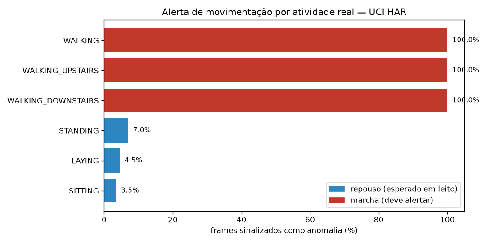
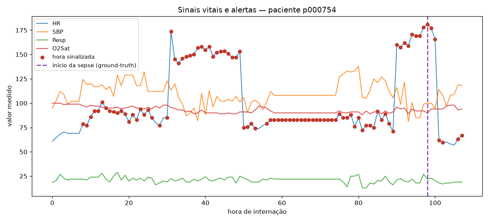
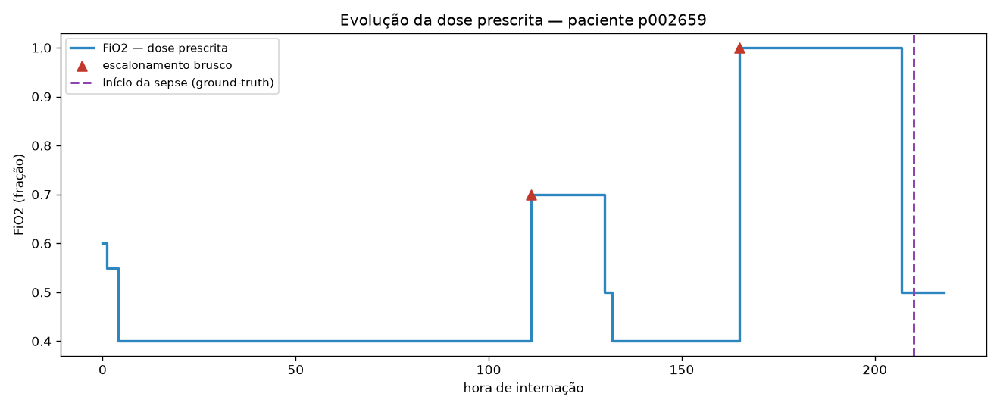

# Entrega 3 — Detecção de Anomalias

Monitoramento de sinais vitais, movimentação e evolução de prescrições em ambiente de internação. Todas as detecções são **não-supervisionadas** (IsolationForest ou regra de degrau); os rótulos do dataset entram apenas na avaliação, como ground-truth.

| Subtarefa | Dataset | Ground-truth | Resultado principal |
|---|---|---|---|
| Movimentação | UCI HAR | atividade real | F1 0.973, AUC 0.9999 |
| Sinais vitais | Challenge 2019 | SepsisLabel | AUC 0.5550, lead 30 h |
| Prescrições (derivada) | Challenge 2019 | SepsisLabel | sepse 17.9% vs 10.5% |

## 1. Padrões de movimentação

O modelo é treinado **apenas** com as 4067 amostras de repouso (deitado, sentado, em pé) e nunca vê marcha no treino. No teste, com 2947 amostras de 9 sujeitos:

- **Recall 100.0%** — as três atividades de marcha foram detectadas integralmente (1387 de 1387).
- **Precisão 94.7%**, F1 0.973, AUC 0.9999.
- **Falso alarme 5.0%** sobre as amostras de repouso (78 de 1560).

Interpretação clínica: um paciente que deveria estar em repouso e começa a deambular é detectado sem exceção. O custo é um alarme falso a cada vinte leituras de repouso, ajustável pelo parâmetro de contaminação.

### Taxa de alerta por atividade real

| activity           |   samples |   alert_rate | is_movement   |
|:-------------------|----------:|-------------:|:--------------|
| WALKING_DOWNSTAIRS |       420 |       1      | True          |
| WALKING            |       496 |       1      | True          |
| WALKING_UPSTAIRS   |       471 |       1      | True          |
| STANDING           |       532 |       0.0695 | False         |
| LAYING             |       537 |       0.0447 | False         |
| SITTING            |       491 |       0.0346 | False         |

## 2. Sinais vitais

O detector é **treinado em 3187 pacientes que nunca desenvolveram sepse** (117947 horas) e avaliado em **1813 pacientes retidos**, que não aparecem no treino — 76888 horas, 446 com sepse (prevalência horária 5.5%).

A coorte de treino exclui pacientes sépticos de propósito: é o padrão de normalidade que o detector deve aprender. Mantê-los no treino ensinaria ao modelo que a deterioração é normal. As métricas abaixo são, portanto, de **generalização** — o que o detector faz com séries que nunca viu.

O limiar de alerta é **absoluto** (-0.4694), fixado no percentil 5% dos scores do treino, e não um percentil calculado dentro de cada paciente. A diferença é operacional: com corte percentual por paciente, todo paciente recebe alerta por construção — sempre existe um "5% pior" — e a taxa deixa de ser comparável entre pacientes.

- AUC 0.5550 e AUPRC 0.0680, contra uma prevalência de 0.0555.
- **156 dos 446** pacientes com sepse receberam algum alerta durante a internação.
- **111** foram avisados **dentro da janela de 48 h** que antecede o início — antecedência mediana **30 h**.

A distinção entre os dois números acima é deliberada. Contar a antecedência a partir do *primeiro alerta da internação inteira* infla o resultado sem significado clínico: há paciente com sepse na hora 248 e alertas nas primeiras 60 horas, o que produziria uma "antecedência" de 239 horas para um alerta sem relação com o evento. Só contam alertas nas 48 horas anteriores ao início.

O resultado hora-a-hora é fraco — a AUC fica pouco acima do acaso. A leitura honesta é que os sinais vitais isolados não separam bem a hora de sepse da hora estável.

### Onde está o sinal: vitais contra laboratório

| features                  |   n_features |   roc_auc |   auprc |
|:--------------------------|-------------:|----------:|--------:|
| sinais vitais             |            7 |    0.5708 |  0.0291 |
| marcadores de laboratório |            8 |    0.6281 |  0.0342 |
| vitais + laboratório      |           15 |    0.6281 |  0.0349 |

Os marcadores de laboratório discriminam melhor que os sinais vitais **apesar de terem cobertura muito menor** (4% a 14% das horas, contra 83% a 91% dos vitais). É coerente com a clínica: lactato e leucócitos são marcadores diretos de sepse, enquanto a alteração dos vitais é tardia. A entrega mantém os vitais como objeto, conforme o escopo, e registra a comparação como limitação medida.

### Limitações medidas

- **Menos da metade dos pacientes com sepse é avisada dentro da janela.** É a consequência direta de usar um limiar absoluto: ele não garante alerta para todo paciente, ao contrário do corte percentual por paciente, que garantia mas não era um detector aplicável. Baixar o limiar aumenta a cobertura ao custo de mais alarme falso — a escolha depende de quanto ruído a equipe tolera.
- `EtCO2` consta do schema mas tem **0% de cobertura** no training set A; a coluna é descartada automaticamente.
- O `SepsisLabel` marca a janela em que a sepse é considerada instalada, e não "hora anormal". Um alerta fora dessa janela não é necessariamente falso — pode ser instabilidade real que não evoluiu para sepse. A precisão hora-a-hora é, portanto, conservadora por construção.

## 3. Evolução de prescrições (variável derivada)

Não existe fonte pública aberta e granular de prescrições hospitalares — a base de referência é o MIMIC-IV, que exige credenciamento. A subtarefa usa, no lugar, a **FiO2** (fração inspirada de oxigênio) do próprio Challenge 2019: ao contrário dos demais campos, que são medições do paciente, a FiO2 é um valor **prescrito e titulado pela equipe**, e sua série ao longo das horas é uma série de doses.

Com 2942 pacientes elegíveis (de 5000; cobertura da FiO2 14.2%) e degrau de 0.15:

- 963 escalonamentos e 2374 reduções de dose.
- Entre os pacientes que escalonaram, **17.9%** desenvolveram sepse; entre os que não escalonaram, **10.5%** — cerca de duas vezes mais.
- Recall 34.6%, precisão 17.9%.
- **53** pacientes escalonaram dentro da janela de 48 h antes do início, com antecedência mediana **20 h**.

Ressalva a declarar: é uma **proxy** de prescrição, não a prescrição registrada em prontuário. O escalonamento de oxigênio é uma decisão terapêutica real, mas cobre apenas um eixo do que uma base de prescrições traria.

## 4. Resumo

As três subtarefas têm desempenhos muito diferentes, e a diferença é informativa:

1. **Movimentação** (AUC 0.9999) — o problema é quase separável. Marcha e repouso são estados fisicamente distintos, medidos por sensores de alta cobertura.
2. **Prescrições** — sinal fraco mas consistente: o escalonamento de dose dobra a probabilidade de sepse.
3. **Sinais vitais** (AUC 0.5550) — o mais próximo do acaso hora-a-hora. Deterioração clínica é um processo lento e ruidoso, e os vitais reagem depois dos marcadores de laboratório.

Para o fluxo de alerta, isso sugere pesos distintos: o alerta de movimentação pode ser automático; o de vitais deve ser tratado como triagem, para revisão humana, e não como diagnóstico.

---

Detecção executada localmente com `scikit-learn` (`random_state=42`). Os dois serviços gerenciados dedicados a anomalia em séries temporais foram retirados do mercado — o Azure Anomaly Detector não aceita novos recursos desde setembro de 2023 e o Amazon Lookout for Metrics encerrou o suporte em 10 de outubro de 2025. Ver §6.2 do relatório técnico.
