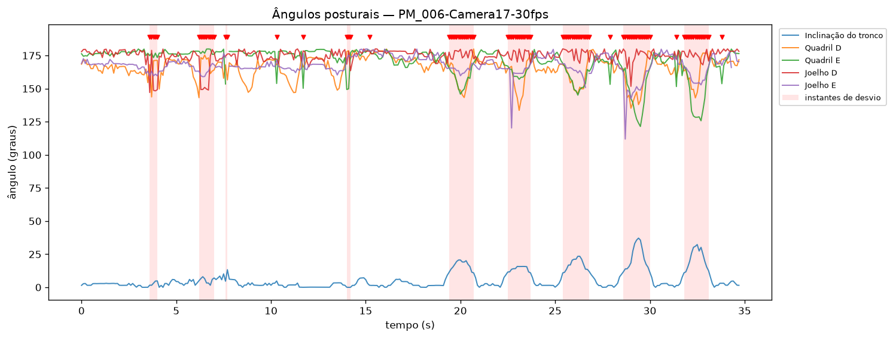

# Relatório automático de desvios posturais — PM_006-Camera17-30fps

**Exercício:** Abdução de perna (Ex4) — *rótulo do dataset, não detectado automaticamente*

## Gráfico

## Análise

Ao longo dos 35s analisados, o sistema sinalizou 96 de 348 instantes (27.6%) como **desvio postural** em relação ao padrão predominante do próprio vídeo. Os pontos abaixo resumem os achados para orientar a revisão clínica.

- **Articulação mais afetada:** Inclinação do tronco — predominante em 68 dos 96 instantes sinalizados (71%).
- **Concentração temporal:** o maior acúmulo de desvios ocorre entre 25s e 30s (60% dos instantes dessa janela sinalizados).
- **Pico de severidade:** em t=7s, no(a) Cotovelo E (z=28.9).
- **Inclinação máxima do tronco:** 37° — inclinação acentuada, possível projeção do tronco à frente.
- **Maior amplitude de movimento:** Cotovelo E (180°).

Recomenda-se que a equipe revise a execução nos períodos destacados em vermelho no gráfico. **Este relatório é gerado automaticamente e não substitui a avaliação de um profissional de saúde.**

## Cobertura de detecção das juntas (%)

Juntas com baixa detecção (<60% dos frames) — podem prejudicar os ângulos associados:

- LEar: 3.2%

## Estatística dos ângulos (graus)

| Variável          | Articulação          |   Média |   Mín |   Máx |   Amplitude |
|:------------------|:---------------------|--------:|------:|------:|------------:|
| r_elbow           | Cotovelo D           |   170.7 | 147.7 | 179.9 |        32.2 |
| l_elbow           | Cotovelo E           |   171.4 |   0.1 | 180   |       179.9 |
| r_shoulder        | Ombro D              |    14.2 |   3.2 |  34.3 |        31.1 |
| l_shoulder        | Ombro E              |     9.3 |   0.1 |  37.7 |        37.7 |
| r_hip             | Quadril D            |   165.5 | 133.6 | 179.9 |        46.3 |
| l_hip             | Quadril E            |   170.1 | 121.4 | 179.9 |        58.5 |
| r_knee            | Joelho D             |   174.8 | 147.1 | 180   |        32.9 |
| l_knee            | Joelho E             |   167.7 | 111.9 | 180   |        68   |
| trunk_inclination | Inclinação do tronco |     5.9 |   0   |  37.1 |        37.1 |

## Resumo e principais eventos de desvio

- **Frames analisados:** 348 (~34.8 s a 10 fps)
- **Frames sinalizados como desvio:** 96 (27.6%)
- **Eventos de desvio (intervalos contíguos):** 15
- **Tempo de processamento:** Análise 00:02.211

| Início (s) | Fim (s) | Duração (s) | Articulação predominante | Severidade (z máx) |
|---|---|---|---|---|
| 3.6 | 4.0 | 0.5 | Joelho D | 8.6 |
| 6.2 | 7.0 | 0.9 | Joelho D | 28.9 |
| 7.6 | 7.7 | 0.2 | Cotovelo E | 16.2 |
| 10.3 | 10.3 | 0.1 | Quadril E | 4.2 |
| 11.7 | 11.7 | 0.1 | Quadril E | 5.0 |
| 14.0 | 14.2 | 0.3 | Quadril E | 5.2 |
| 15.2 | 15.2 | 0.1 | Cotovelo D | 3.6 |
| 19.4 | 20.7 | 1.4 | Inclinação do tronco | 7.8 |
| 22.5 | 23.7 | 1.3 | Inclinação do tronco | 8.7 |
| 25.4 | 26.8 | 1.5 | Inclinação do tronco | 9.0 |
| 27.9 | 27.9 | 0.1 | Quadril E | 4.4 |
| 28.6 | 30.0 | 1.5 | Inclinação do tronco | 15.1 |
| 31.4 | 31.4 | 0.1 | Quadril E | 4.7 |
| 31.8 | 33.1 | 1.4 | Inclinação do tronco | 12.9 |
| 33.8 | 33.8 | 0.1 | Quadril E | 4.3 |
