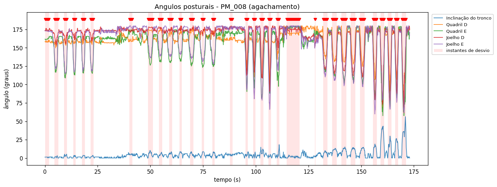

# Relatório automático de desvios posturais — PM_008

## Gráfico

## Análise

Ao longo dos 173s analisados, o sistema sinalizou 576 de 1731 instantes (33.3%) como **desvio postural** em relação ao padrão predominante do próprio vídeo. Os pontos abaixo resumem os achados para orientar a revisão clínica.

- **Articulação mais afetada:** Joelho D — predominante em 234 dos 576 instantes sinalizados (41%).
- **Concentração temporal:** o maior acúmulo de desvios ocorre entre 159s e 173s (52% dos instantes dessa janela sinalizados).
- **Pico de severidade:** em t=170s, no(a) Joelho D (z=25.7).
- **Inclinação máxima do tronco:** 56° — inclinação acentuada, possível projeção do tronco à frente.
- **Maior amplitude de movimento:** Cotovelo D (180°).

Recomenda-se que a equipe revise a execução nos períodos destacados em vermelho no gráfico. **Este relatório é gerado automaticamente e não substitui a avaliação de um profissional de saúde.**

## Cobertura de detecção das juntas (%)

Todas as juntas detectadas em ≥60% dos frames.

## Estatística dos ângulos (graus)

| Variável          | Articulação          |   Média |   Mín |   Máx |   Amplitude |
|:------------------|:---------------------|--------:|------:|------:|------------:|
| r_elbow           | Cotovelo D           |   141.5 |   0.2 | 180   |       179.8 |
| l_elbow           | Cotovelo E           |   158.2 |   1   | 180   |       179   |
| r_shoulder        | Ombro D              |    26.8 |   0   | 107.6 |       107.6 |
| l_shoulder        | Ombro E              |    33.6 |   0   | 101.6 |       101.5 |
| r_hip             | Quadril D            |   160.5 |  67.7 | 179.9 |       112.2 |
| l_hip             | Quadril E            |   153.3 |  57.6 | 179.9 |       122.3 |
| r_knee            | Joelho D             |   165.5 |  61.5 | 180   |       118.5 |
| l_knee            | Joelho E             |   158.4 |  59.9 | 180   |       120.1 |
| trunk_inclination | Inclinação do tronco |     4.7 |   0   |  56.3 |        56.3 |

## Resumo e principais eventos de desvio

- **Frames analisados:** 1731 (~173.1 s a 10 fps)
- **Frames sinalizados como desvio:** 576 (33.3%)
- **Eventos de desvio (intervalos contíguos):** 33

| Início (s) | Fim (s) | Duração (s) | Articulação predominante | Severidade (z máx) |
|---|---|---|---|---|
| 0.0 | 1.9 | 2.0 | Ombro D | 8.5 |
| 4.5 | 6.3 | 1.9 | Cotovelo E | 16.0 |
| 9.1 | 10.5 | 1.5 | Cotovelo D | 9.8 |
| 13.4 | 14.6 | 1.3 | Cotovelo D | 9.8 |
| 17.6 | 18.9 | 1.4 | Cotovelo D | 9.8 |
| 21.6 | 23.0 | 1.5 | Cotovelo D | 9.9 |
| 40.1 | 41.5 | 1.5 | Cotovelo E | 5.8 |
| 48.9 | 51.2 | 2.4 | Cotovelo E | 17.7 |
| 54.0 | 55.6 | 1.7 | Cotovelo D | 17.1 |
| 58.7 | 58.7 | 0.1 | Cotovelo D | 3.5 |
| 58.9 | 60.4 | 1.6 | Cotovelo D | 8.5 |
| 63.8 | 64.9 | 1.2 | Cotovelo D | 8.2 |
| 68.8 | 70.4 | 1.7 | Cotovelo D | 5.6 |
| 74.4 | 75.5 | 1.2 | Joelho E | 6.0 |
| 79.4 | 80.5 | 1.2 | Joelho E | 4.5 |
| 87.8 | 89.0 | 1.3 | Cotovelo D | 9.8 |
| 95.2 | 96.3 | 1.2 | Joelho D | 14.0 |
| 98.7 | 99.8 | 1.2 | Joelho E | 12.9 |
| 102.3 | 103.7 | 1.5 | Joelho D | 14.8 |
| 106.0 | 107.3 | 1.4 | Joelho D | 18.9 |
| 110.0 | 111.2 | 1.3 | Cotovelo E | 8.4 |
| 114.6 | 120.8 | 6.3 | Ombro D | 8.6 |
| 128.0 | 128.3 | 0.4 | Joelho D | 5.2 |
| 131.9 | 134.0 | 2.2 | Joelho D | 12.2 |
| 136.2 | 138.4 | 2.3 | Joelho D | 13.4 |
| 140.7 | 143.0 | 2.4 | Joelho D | 12.6 |
| 145.1 | 147.3 | 2.3 | Joelho D | 14.1 |
| 149.5 | 151.6 | 2.2 | Joelho D | 14.5 |
| 155.6 | 157.4 | 1.9 | Joelho D | 21.5 |
| 159.2 | 161.0 | 1.9 | Joelho D | 23.0 |
| 162.7 | 164.4 | 1.8 | Joelho D | 21.7 |
| 166.1 | 167.6 | 1.6 | Joelho D | 19.6 |
| 169.3 | 171.4 | 2.2 | Joelho D | 25.7 |
