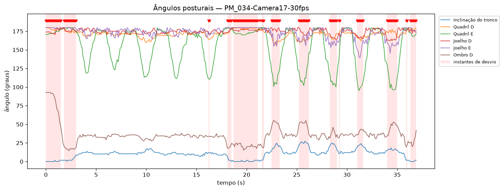

# Relatório automático de desvios posturais — PM_034-Camera17-30fps

**Exercício:** Abdução de perna (Ex4) — *rótulo do dataset, não detectado automaticamente*

## Gráfico

## Análise

Ao longo dos 37s analisados, o sistema sinalizou 122 de 370 instantes (33.0%) como **desvio postural** em relação ao padrão predominante do próprio vídeo. Os pontos abaixo resumem os achados para orientar a revisão clínica.

- **Articulação mais afetada:** Ombro D — predominante em 59 dos 122 instantes sinalizados (48%).
- **Concentração temporal:** o maior acúmulo de desvios ocorre entre 0s e 5s (58% dos instantes dessa janela sinalizados).
- **Pico de severidade:** em t=0s, no(a) Ombro E (z=17.7).
- **Inclinação máxima do tronco:** 27°.
- **Maior amplitude de movimento:** Cotovelo E (137°).

Recomenda-se que a equipe revise a execução nos períodos destacados em vermelho no gráfico. **Este relatório é gerado automaticamente e não substitui a avaliação de um profissional de saúde.**

## Cobertura de detecção das juntas (%)

Todas as juntas detectadas em ≥60% dos frames.

## Estatística dos ângulos (graus)

| Variável          | Articulação          |   Média |   Mín |   Máx |   Amplitude |
|:------------------|:---------------------|--------:|------:|------:|------------:|
| r_elbow           | Cotovelo D           |   169   | 157   | 179.9 |        23   |
| l_elbow           | Cotovelo E           |   166.4 |  42.8 | 180   |       137.2 |
| r_shoulder        | Ombro D              |    35.5 |  14.4 |  93   |        78.6 |
| l_shoulder        | Ombro E              |    19.1 |   0   |  92.4 |        92.4 |
| r_hip             | Quadril D            |   171.5 | 156.6 | 179.8 |        23.2 |
| l_hip             | Quadril E            |   154.6 |  95.1 | 179.9 |        84.7 |
| r_knee            | Joelho D             |   174.5 | 162.3 | 180   |        17.7 |
| l_knee            | Joelho E             |   173.1 | 139   | 180   |        41   |
| trunk_inclination | Inclinação do tronco |    10.3 |   0   |  27.2 |        27.2 |

## Resumo e principais eventos de desvio

- **Frames analisados:** 370 (~37.0 s a 10 fps)
- **Frames sinalizados como desvio:** 122 (33.0%)
- **Eventos de desvio (intervalos contíguos):** 15
- **Tempo de processamento:** Análise 00:03.729

| Início (s) | Fim (s) | Duração (s) | Articulação predominante | Severidade (z máx) |
|---|---|---|---|---|
| 0.0 | 1.5 | 1.6 | Ombro E | 17.7 |
| 1.8 | 3.0 | 1.3 | Ombro D | 5.9 |
| 16.2 | 16.3 | 0.2 | Quadril E | 3.6 |
| 18.1 | 18.5 | 0.5 | Ombro D | 4.9 |
| 18.7 | 21.1 | 2.5 | Ombro D | 5.6 |
| 21.3 | 21.3 | 0.1 | Ombro D | 3.8 |
| 21.5 | 21.7 | 0.3 | Ombro D | 4.8 |
| 22.5 | 23.3 | 0.9 | Ombro D | 15.1 |
| 25.2 | 26.2 | 1.1 | Inclinação do tronco | 6.0 |
| 28.3 | 29.0 | 0.8 | Ombro E | 5.7 |
| 29.2 | 29.3 | 0.2 | Ombro E | 3.9 |
| 31.0 | 31.6 | 0.7 | Joelho E | 6.2 |
| 34.0 | 35.0 | 1.1 | Ombro D | 5.3 |
| 35.9 | 36.0 | 0.2 | Ombro D | 4.4 |
| 36.3 | 36.9 | 0.7 | Inclinação do tronco | 4.8 |
